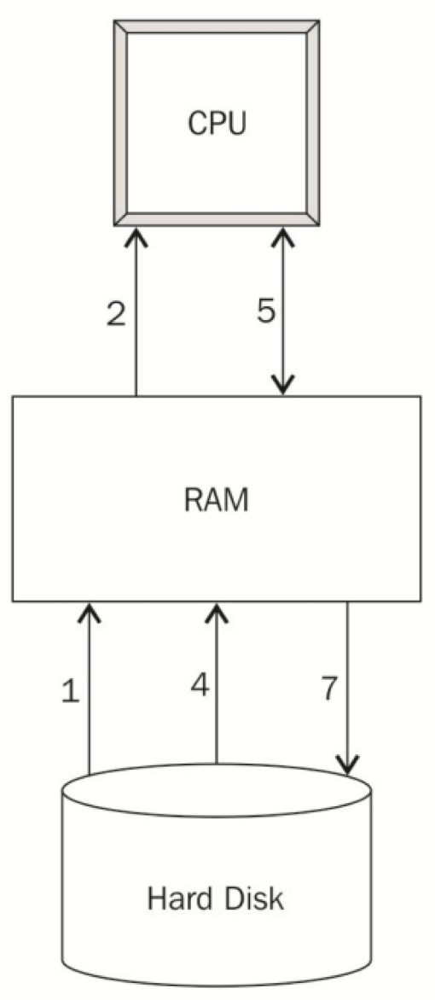

# Introduction {#intro}

## Logistics

- Fall 2 course
- Tuesday and Thursday, 11:30am-1pm
- Contact info: Christine Choirat (cchoirat@iq.harvard.edu).  Please use BST232 in the email title.
- TA's: Qian Di (qiandi@mail.harvard.edu) and Ben Sabath (mbsabath@hsph.harvard.edu)
- Office hours:
    - Ben: Tuesday 1:30-2:30pm
    - Qian:  Thursday 10:30-11:30am
    - Christine: Thursday 3-4pm
- Course GitHub repository https://github.com/cchoirat/bigdata17
- Open file in folder `_book/index.html`
- These course notes are **work in progress**.

## Prerequisites

For BST262 (Computing for Big Data), we assume familiarity with the material covered in BST260 (Introduction to Data Science).

We will use R to present concepts that are mostly language-agnostic.  We could have used Python, as in BST261 (Data Science II).

## Rationale

1. Available data grows at a much faster rate than available computing capacity.

2. Statistical software programs such as R were not designed to handle datasets of massive size.

## Big data bottlenecks

As described by @Lim2015, there are three bottlenecks:

- CPU
- RAM
- I/O

```{r echo=FALSE, fig.align="center", bottlenecks, fig.cap="Steps to execute an R program, from @Lim2015, Chapter 1."}

```
```{exercise}
Can you identify points 1--7 in the following code snippet?
```

```{r eval=FALSE}
data <- read.csv("mydata.csv")
totals <- colSums(data)
write.csv(totals, "totals.csv")
```

## Syllabus

Part I – Good code still matters _(even with lots of computing resources)_

Week 1 - Basic tools

- Lecture 1. Unix scripting, make
- Lecture 2. Version control: Git and GitHub (guest lecture: Ista Zhan)

Week 2 - Creating and maintaining R packages

- Lecture 3. Rationale, package structure, available tools
- Lecture 4. Basics of software engineering: unit testing, code coverage, continuous integration

Week 3 - Software optimization

- Lecture 5. Measuring performance: profiling and benchmarking tools
- Lecture 6. Improving performance: an introduction to C/C++, Rcpp

Part II – Scaling up _(don’t use big data tools for small data)_

Week 4 – Databases

- Lecture 7. Overview of SQL (SQLite, PostgreSQL) and noSQL databases (HBase,
MongoDB, Cassandra, BigTable, ...)
- Lecture 8. R database interfaces (in particular through dplyr and mongolite)

Week 5 - Analyzing data that does not fit in memory

- Lecture 9. Pure R solutions (sampling, `ff` and `bigmemory`, other interpreters). JVM solutions (h20, Spark)
- Lecture 10. An introduction to parallel computing; clusters and cloud computing.
“Divide and Conquer” (MapReduce approaches)

Week 6 – Visualization

- Lecture 11. Principles of visualization (guest lecture: James Honaker)
- Lecture 12. Maps and GIS: principles of GIS, using R as a GIS, PostGIS

Weeks 7 & 8 - Guest lectures (order and precise schedule TBD)

- Software project management (Danny Brooke)
- R and Spark (Ellen Kraffmiller and Robert Treacy)
- Advanced GIS and remote sensing (TBD)
- Cluster architecture (William J. Horka)

## Evaluation

Grades will be based on **two mandatory problem sets**. Each problem set will correspond to 50% (= 50 points) of the final grade. The first problem set will be available by the end of week 3 and the second problem set by the end of week 6.

You will be required to submit problem set solutions within two weeks. Grades, and feedback when appropriate, will be returned two weeks after submission.

You will submit a markdown document that combines commented code for data analysis and detailed and structured explanations of the algorithms and software tools that you used.

## Software tools and packages

We will mostly use [R](https://www.r-project.org/) in this course.  Some examples will be run in [Python](https://www.python.org/).

In general, we will use free and open-source software programs such as [PostgreSQL](https://www.postgresql.org/) / [PostGIS](http://postgis.net/) or [Spark](https://spark.apache.org/).

## Datasets

We have collected datasets to illustrate concepts.  They are hosted on a [Dropbox folder](https://www.dropbox.com/sh/mt4a7goxsl44swm/AADJK54wOXlDZjABMxN0DJIHa?dl=0).

### MovieLens

MovieLens by @Harper2015 [, https://grouplens.org/datasets/movielens/] collects datasets from the website https://movielens.org/.

There are datasets of different sizes.  We will use:

1. Small (1MB): https://grouplens.org/datasets/movielens/latest/
2. Benchmark (~190MB zipped): https://grouplens.org/datasets/movielens/20m/

### Airlines data

The airlines dataset comes from the U.S. Department of Transportation and were used in the [2009 Data Expo](http://stat-computing.org/dataexpo/2009/) of the American Statistical Association (ASA).

We will use a version curated by [h2o](https://www.h2o.ai/): https://github.com/h2oai/h2o-2/wiki/Hacking-Airline-DataSet-with-H2O. 

### Insurance claims

Claims data contain Protected Health Information (PHI).  There are strong privacy restrictions to store, use and share this type of data.

We will use [synthetic data](https://www.cms.gov/Research-Statistics-Data-and-Systems/Downloadable-Public-Use-Files/SynPUFs/DE_Syn_PUF.html) ([Sample 1](https://www.cms.gov/Research-Statistics-Data-and-Systems/Downloadable-Public-Use-Files/SynPUFs/DESample01.html)) from the Centers for Medicare and Medicaid Services (CMS).

### Census

Census data is commonly merged with administrative claims data such as Medicare.  We will use data from the [Census Bureau](https://www.census.gov/data.html).

### PM~2.5~ exposure

We will use PM~2.5~ exposure data from the [EPA Air Quality System (AQS)](https://www.epa.gov/aqs) to illustrate GIS linkage concepts.

### Methylation

If there is enough interest, we might present methylation examples.

## Contributing with GitHub

If you have suggestions, you can open a GitHub issue at https://github.com/cchoirat/bigdata17/issues.

If you want to contribute, we welcome [pull requests](https://help.github.com/articles/about-pull-requests/).

## Before we start...

How much R do you know?

Introduction to R: http://tutorials.iq.harvard.edu/R/Rintro/Rintro.html

Regression models in R: http://tutorials.iq.harvard.edu/R/Rstatistics/Rstatistics.html

R graphics: http://tutorials.iq.harvard.edu/R/Rgraphics/Rgraphics.html

R programming: http://tutorials.iq.harvard.edu/R/RProgramming/Rprogramming.html

## Style

Reading: http://adv-r.had.co.nz/Style.html

