# Packages {#packages}

We strongly recommand @Wickham2015.

We assume the following packages are installed:

```{r, eval=FALSE}
install.packages(c("devtools", "roxygen2", "testthat", "knitr"))
```

## Why?

- Organize your code

- Distribute your code

- Keep versions of your code

## Package structure

- Folder hierarchy
    - `NAMESPACE`: package import / export
    - `DESCRIPTION`: metadata
    - `R/`: R code
    - `man/`: object documentation (with short examples)
    - `tests/`
    - `data/`
    - `src/`: compiled code
    - `vignettes/`: manual-like documentation
    - `inst/`: installed files
    - `demo/`: longer examples
    - `exec`, `po`, `tools`

## Building steps

- `R CMD build`

- `R CMD INSTALL`

- `R CMD check`

### `R CMD build`

```{r eval=FALSE}
R CMD build --help
```

_Build R packages from package sources in the directories specified by ‘pkgdirs’_

### `R CMD INSTALL`

```{r eval=FALSE}
R CMD INSTALL --help
```

_Install the add-on packages specified by pkgs.  The elements of pkgs can be relative or absolute paths to directories with the package sources, or to gzipped package 'tar' archives.  The library tree to install to can be specified via '--library'.  By default, packages are installed in the library tree rooted at the first directory in .libPaths() for an R session run in the current environment._

### `R CMD check`

```{r eval=FALSE}
R CMD check --help
```

http://r-pkgs.had.co.nz/check.html

_Check R packages from package sources, which can be directories or package 'tar' archives with extension '.tar.gz', '.tar.bz2', '.tar.xz' or '.tgz'._

_A variety of diagnostic checks on directory structure, index and control files are performed.  The package is installed into the log directory and production of the package PDF manual is tested. All examples and tests provided by the package are tested to see if they run successfully.  By default code in the vignettes is tested, as is re-building the vignette PDFs._

### Building steps with `devtools`

- `devtools::build`

- `devtools::install`

- `devtools::check`

- and many others: `load_all`, `document`, `test`, `run_examples`, ...

## Create an R package

### `utils::package.skeleton`

```{r eval=FALSE}
package.skeleton() # "in "clean" session ("anRpackage")
package.skeleton("pkgname") # in "clean" session

set.seed(02138)
f <- function(x, y) x+y
g <- function(x, y) x-y
d <- data.frame(a = 1, b = 2)
e <- rnorm(1000)
package.skeleton(list = c("f","g","d","e"), name = "pkgname")
```

### `devtools::create`

```{r eval=FALSE}
devtools::create("path/to/package/pkgname")
```

### Submit to CRAN

```{r echo=FALSE, fig.align="center", hydra, fig.cap="Submitting to CRAN.  It's not that bad..."}

```

Reading: http://r-pkgs.had.co.nz/release.html

## R packages on GitHub

Reading: http://r-pkgs.had.co.nz/git.html

- Version control

- Website, wiki, project management

- Easy install: `install_github` from `devtools`

- Collaboration

- Issue tracking

#### RStudio and GitHub integration

```{r echo=FALSE, fig.align="center", pkg1, fig.cap="Create a new Linreg repository on GitHub"}
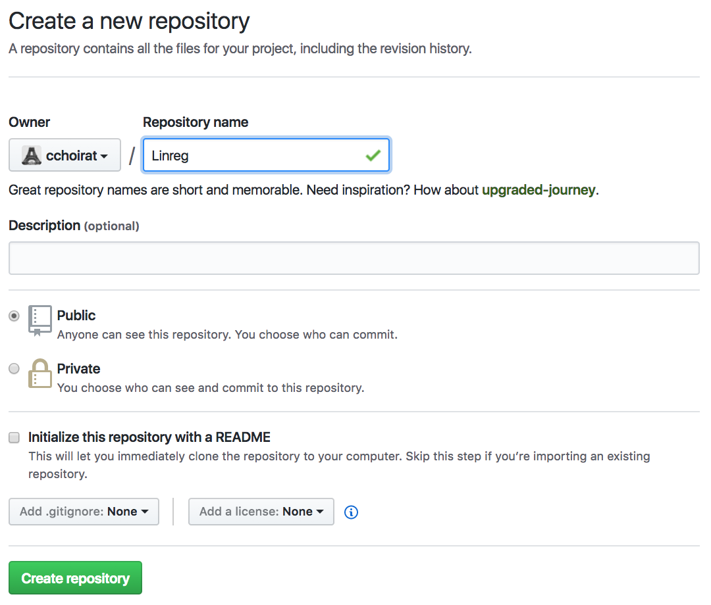
```

```{r echo=FALSE, fig.align="center", pkg2, fig.cap="Create a new project in RStudio"}
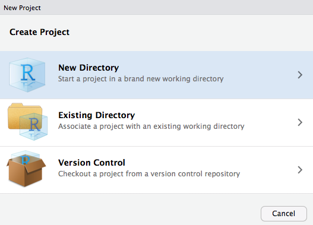
```

```{r echo=FALSE, fig.align="center", pkg3, fig.cap="Select R package"}
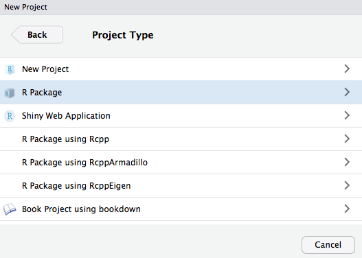
```

```{r echo=FALSE, fig.align="center", pkg4, fig.cap="Create the Linreg R package as a Git repository"}
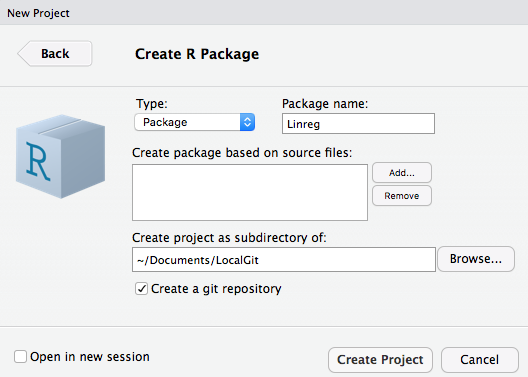
```

```{r echo=FALSE, fig.align="center", pkg5, fig.cap="Automatically created files"}
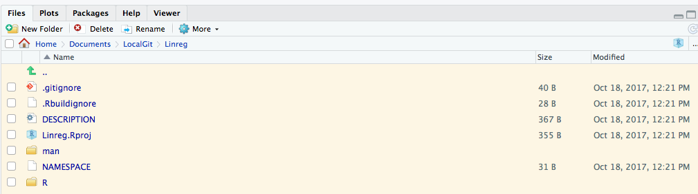
```

```{r echo=FALSE, fig.align="center", pkg6, fig.cap="Build tab in RStudio"}
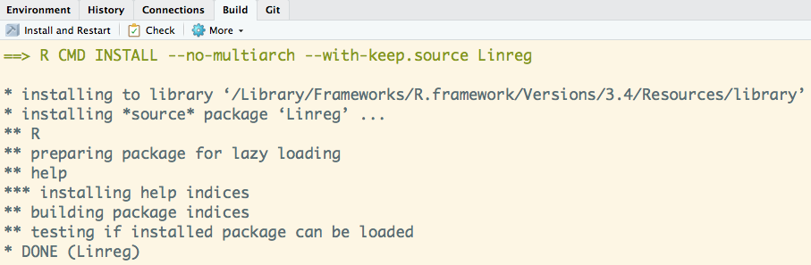
```

```{r echo=FALSE, fig.align="center", pkg7, fig.cap="Github webpage"}
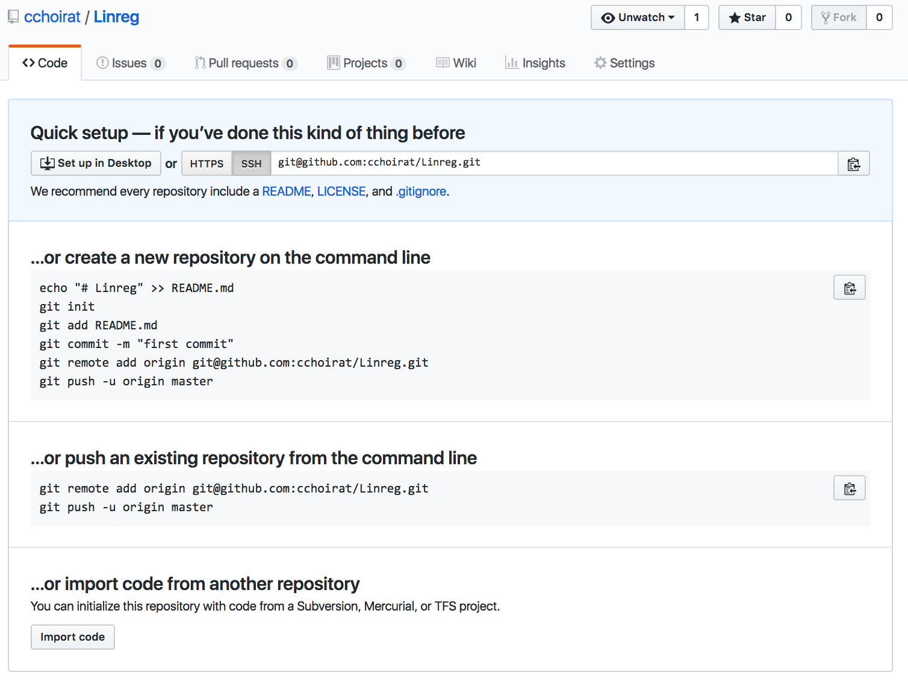
```

```{r echo=FALSE, fig.align="center", term, fig.cap="Open a terminal"}
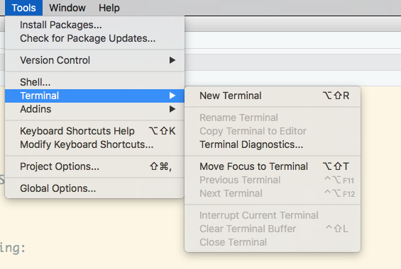
```

__Command line__

```{r eval=FALSE}
# git init # already run when creating package with RStudio
git add *
git commit -m "First commit"
git remote add origin https://github.com/cchoirat/Linreg
git push -u origin master
```

```{r echo=FALSE, fig.align="center", pkg9, fig.cap="Github webpage is updated"}
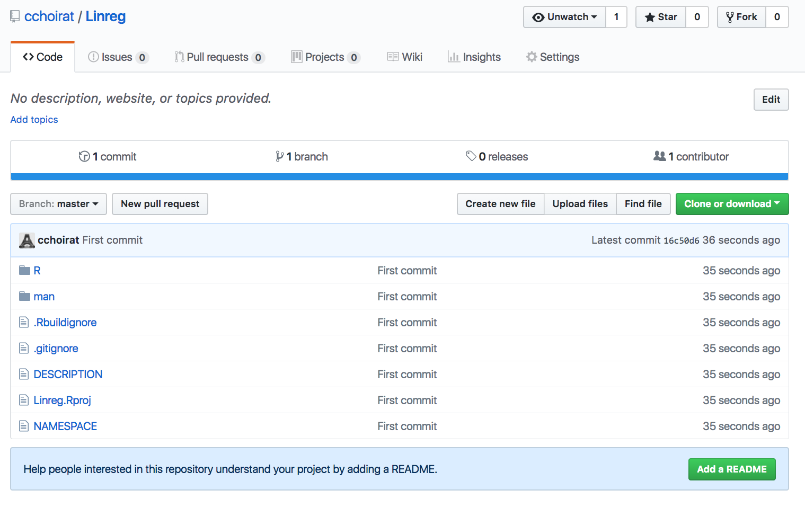
```

### `.gitignore`

RStudio default

```{r eval=FALSE}
.Rproj.user
.Rhistory
.RData
```

GitHub default

```{r eval=FALSE}
# History files
.Rhistory
.Rapp.history

# Example code in package build process
*-Ex.R

# RStudio files
.Rproj.user/

# produced vignettes
vignettes/*.html
vignettes/*.pdf
```

## RStudio projects

- `.Rproj` file extension, in our example `pkgtemplate.Rproj`

- A project has its own:
    - R session
    - .Rprofile (_e.g._, to customize startup environment)
    - .Rhistory

- Default working directory is project directory

- Keeps track of project-specific recent files

### Project options

```{r eval=FALSE}
Version: 1.0

RestoreWorkspace: Default
SaveWorkspace: Default
AlwaysSaveHistory: Default

EnableCodeIndexing: Yes
UseSpacesForTab: Yes
NumSpacesForTab: 2
Encoding: UTF-8

RnwWeave: knitr
LaTeX: pdfLaTeX

AutoAppendNewline: Yes
StripTrailingWhitespace: Yes

BuildType: Package
PackageUseDevtools: Yes
PackageInstallArgs: --no-multiarch --with-keep.source
```

### Package documentation

- Functions and methods

- Vignettes
    - PDF
    - `knitr` (or `Sweave`)

## Package workflow example

Creating R Packages: A Tutorial (Friedrich Leisch, 2009)

- https://cran.r-project.org/doc/contrib/Leisch-CreatingPackages.pdf

### Add `linreg.R` to `R/` directory

```{r eval=TRUE}
linmodEst <- function(x, y) {
  ## compute QR-decomposition of x
  qx <- qr(x)
  ## compute (x’x)^(-1) x’y
  coef <- solve.qr(qx, y)
  ## degrees of freedom and standard deviation of residuals
  df <- nrow(x) - ncol(x)
  sigma2 <- sum((y - x %*% coef) ^ 2) / df
  ## compute sigma^2 * (x’x)^-1
  vcov <- sigma2 * chol2inv(qx$qr)
  colnames(vcov) <- rownames(vcov) <- colnames(x)
  list(
    coefficients = coef,
    vcov = vcov,
    sigma = sqrt(sigma2),
    df = df
  )
}
```

### Run our function

```{r}
data(cats, package = "MASS")
linmodEst(cbind(1, cats$Bwt), cats$Hwt)
```

We can compare the output with `lm`.

```{r}
lm1 <- lm(Hwt ~ Bwt, data = cats)
lm1
coef(lm1)
```

```{r}
vcov(lm1)
summary(lm1)$sigma
```

### Add ROxygen2 documentation

```{r eval=FALSE}
#' Linear regression
#'
#' Runs an OLS regression not unlike \code{\link{lm}}
#'
#' @param y response vector (1 x n)
#' @param X covariate matrix (p x n) with no intercept
#'
#' @return A list with 4 elements: coefficients, vcov, sigma, df
#'
#' @examples
#' data(mtcars)
#' X <- as.matrix(mtcars[, c("cyl", "disp", "hp")])
#' y <- mtcars[, "mpg"]
#' linreg(y, X)
#'
#' @export
#'
linmodEst <- function(x, y) {
  ## compute QR-decomposition of x
  qx <- qr(x)
  ## compute (x’x)^(-1) x’y
  coef <- solve.qr(qx, y)
  ## degrees of freedom and standard deviation of residuals
  df <- nrow(x) - ncol(x)
  sigma2 <- sum((y - x %*% coef) ^ 2) / df
  ## compute sigma^2 * (x’x)^-1
  vcov <- sigma2 * chol2inv(qx$qr)
  colnames(vcov) <- rownames(vcov) <- colnames(x)
  list(
    coefficients = coef,
    vcov = vcov,
    sigma = sqrt(sigma2),
    df = df
  )
}
```

### Configure Build Tools

```{r echo=FALSE, fig.align="center", pkg8, fig.cap="Roxygen options"}
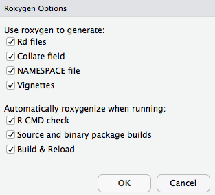
```

### `man` page

File ``man/linmodEst.Rd` contains:

```{r eval=FALSE}
% Generated by roxygen2: do not edit by hand
% Please edit documentation in R/linreg.R
\name{linmodEst}
\alias{linmodEst}
\title{Linear regression}
\usage{
linmodEst(x, y)
}
\arguments{
\item{y}{response vector (1 x n)}

\item{X}{covariate matrix (p x n) with no intercept}
}
\value{
A list with 4 elements: coefficients, vcov, sigma, df
}
\description{
Runs an OLS regression not unlike \code{\link{lm}}
}
\examples{
data(mtcars)
X <- as.matrix(mtcars[, c("cyl", "disp", "hp")])
y <- mtcars[, "mpg"]
linreg(y, X)

}

```

### Formatted output

```{r echo=FALSE, fig.align="center", help, fig.cap=""}
knitr::include_graphics("images/ch3_formatted_help.png")
```

### `DESCRIPTION`

```{r eval=FALSE}
Package: Linreg
Type: Package
Title: What the Package Does (Title Case)
Version: 0.1.0
Author: Who wrote it
Maintainer: The package maintainer <yourself@somewhere.net>
Description: More about what it does (maybe more than one line)
    Use four spaces when indenting paragraphs within the Description.
License: What license is it under?
Encoding: UTF-8
LazyData: true
RoxygenNote: 6.0.1
```

### `NAMESPACE`

`export`'s automatically generated when parsing ROxygen2 snippets

```{r eval=FALSE}
export(linmodEst)
```

### S3 basics

Reading: http://adv-r.had.co.nz/S3.html

```{r}
hello <- function() {
 s <- "Hello World!"
 class(s) <- "hi"
 return(s)
}

hello()
```

```{r}
print.hi <- function(...) {
  print("Surprise!")
}

hello()
```

### S3 and S4 generics

Reading: http://adv-r.had.co.nz/S4.html

```{r}
linmod <- function(x, ...)
  UseMethod("linmod")
```

```{r}
linmod.default <- function(x, y, ...) {
  x <- as.matrix(x)
  y <- as.numeric(y)
  est <- linmodEst(x, y)
  est$fitted.values <- as.vector(x %*% est$coefficients)
  est$residuals <- y - est$fitted.values
  est$call <- match.call()
  class(est) <- "linmod"
  return(est)
}
```

### `print`

```{r}
print.linmod <- function(x, ...) {
  cat("Call:\n")
  print(x$call)
  cat("\nCoefficients:\n")
  print(x$coefficients)
}
```

```{r}
x <- cbind(Const = 1, Bwt = cats$Bwt)
y <- cats$Hw
mod1 <- linmod(x, y)
mod1
```

### Other methods

- `summary.linmod`

- `print.summary.linmod`

- `predict.linmod`

- `plot.linmod`

- `coef.linmod`, `vcov.linmod`, ...

### Formulas and model frames

```{r eval=FALSE}
linmod.formula <- function(formula, data = list(), ...) {
  mf <- model.frame(formula = formula, data = data)
  x <- model.matrix(attr(mf, "terms"), data = mf)
  y <- model.response(mf)
  est <- linmod.default(x, y, ...)
  est$call <- match.call()
  est$formula <- formula
  return(est)
}
```

```{r eval=FALSE}
linmod(Hwt ~ - 1 + Bwt * Sex, data = cats)
```

```{r eval=FALSE}
Call:
linmod.formula(formula = Hwt ~ -1 + Bwt * Sex, data = cats)

Coefficients:
      Bwt      SexF      SexM  Bwt:SexM 
 2.636414  2.981312 -1.184088  1.676265 
```

## Unit testing

### Unit tests and `testthat`

Reading: http://r-pkgs.had.co.nz/tests.html

In package directory:

```{r eval=FALSE}
devtools::use_testthat()
```

pre-populates `test/testthat/`

Test files should start with `test` to be processed.

### `test_coef.R`

```{r eval=FALSE}
data(cats, package = "MASS")
l1 <- linmod(Hwt ~ Bwt * Sex, data = cats)
l2 <- lm(Hwt ~ Bwt * Sex, data = cats)

test_that("same estimated coefficients as lm function", {
  expect_equal(round(l1$coefficients, 3), round(l2$coefficients, 3))
})
```

```{r eval=FALSE}
> devtools::test()
Loading Linreg
Loading required package: testthat
Testing Linreg
.
DONE =========================================================================================
```

## Continuous integration

Reading: http://r-pkgs.had.co.nz/check.html#travis

Website: https://travis-ci.org/

First step is to create a Travis account and link it to you GitHub account.

```{r echo=FALSE, fig.align="center", travis, fig.cap=""}
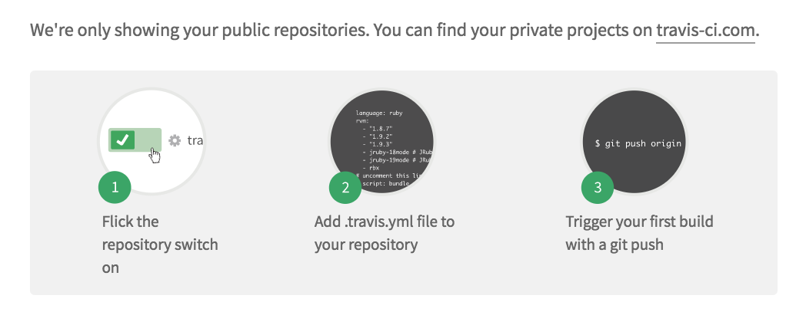
```

Travis will list all your public GitHub repositories for you to select the ones you want to test.

```{r echo=FALSE, fig.align="center", travis_linreg, fig.cap=""}

```

Calling

```{r eval=FALSE}
devtools::use_coverage(pkg = ".", type = c("codecov"))
```

creates the `.travis.yml` file:

```{r eval=FALSE}
# R for travis: see documentation at https://docs.travis-ci.com/user/languages/r

language: R
sudo: false
cache: packages

```

and pushing `Linreg` code to GitHub will automatically triggers a Travis build... which fails!

```{r echo=FALSE, fig.align="center", travis_failed, fig.cap=""}
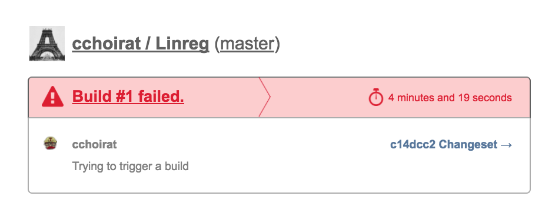
```

To be continued...

## Code coverage

Reading: https://walczak.org/2017/06/how-to-add-code-coverage-codecov-to-your-r-package/

Website: https://codecov.io/

Like Travis, codecov has to be linked to a GitHub account:

```{r echo=FALSE, fig.align="center", codecov, fig.cap=""}
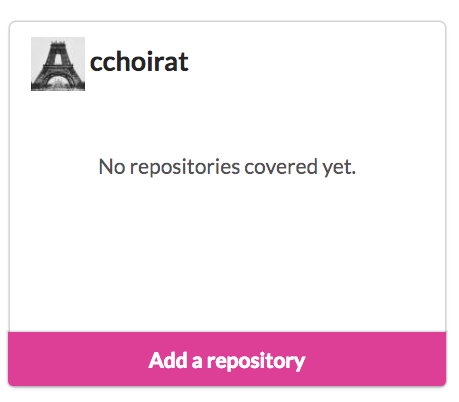
```

```{r eval=FALSE}
devtools::use_coverage(pkg = ".", type = c("codecov"))
```

creates the `codecov.yml` file:

```{r eval=FALSE}
comment: false
```

A call to

```{r eval=FALSE}
covr::codecov(token = "YOUR_TOKEN")
```

will give you code coverage information:

```{r echo=FALSE, fig.align="center", codecov_out, fig.cap=""}
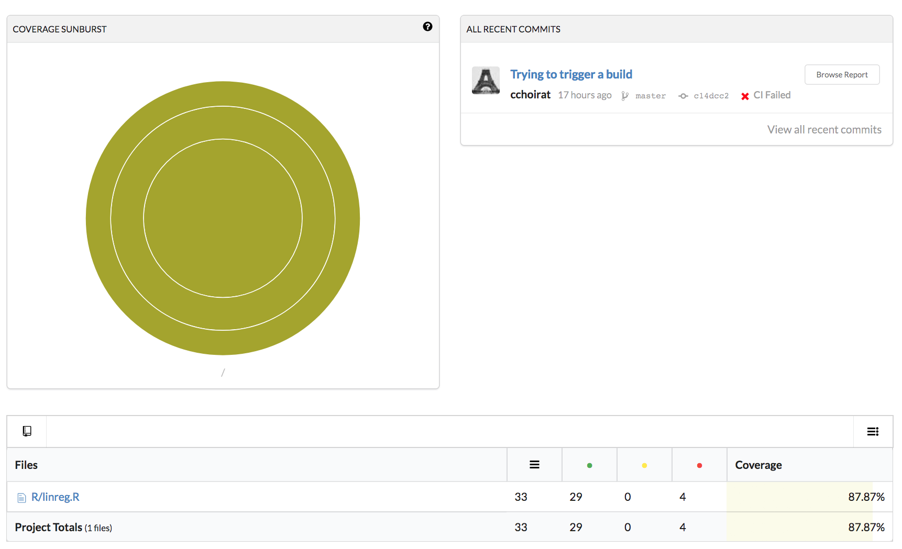
```

## Back to GitHub

Badges can be added to `README.md`:

```{r eval=FALSE}
<!--- Badges ----->
[](https://travis-ci.org/cchoirat/Linreg)
[](https://codecov.io/gh/cchoirat/Linreg)

## `Linreg` package template

Based on "Creating R Packages: A Tutorial" (Friedrich Leisch, 2009)

- https://cran.r-project.org/doc/contrib/Leisch-CreatingPackages.pdf

```

are are automatically displayed on GitHub:

```{r echo=FALSE, fig.align="center", badges, fig.cap=""}
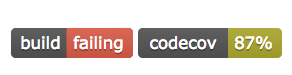
```

## Vignettes

Reading: http://r-pkgs.had.co.nz/vignettes.html

Reading: http://kbroman.org/pkg_primer/pages/vignettes.html

Even if all the functions and datasets of your package are documented, it is still useful to have a more detailed illustation on how to use your package.  A _vignette_ is the right place to explain a worflow and a statistical method.

Running:

```{r eval=FALSE}
devtools::use_vignette("my-linear-regression")
```

creates a `vignettes` folder and provide a template in RMarkdown format `my-linear-regression.Rmd`:

https://github.com/cchoirat/Linreg/blob/master/vignettes/my-linear-regression.Rmd

It also indicates in `DESCRIPTION` that vignettes should be built with `knitr`.

```{r eval=FALSE}
VignetteBuilder: knitr
```

The vignette is built into a HTML document with

```{r eval=FALSE}
devtools::build_vignettes()
```

```{r eval=FALSE}
Building Linreg vignettes
Moving my-linear-regression.html, my-linear-regression.R to inst/doc/
Copying my-linear-regression.Rmd to inst/doc/
```

The vignette is accessible with

```{r}
vignette("my-linear-regression")
vignette("my-linear-regression", package = "Linreg")
```


```{r echo=FALSE, fig.align="center", vignette_html, fig.cap=""}
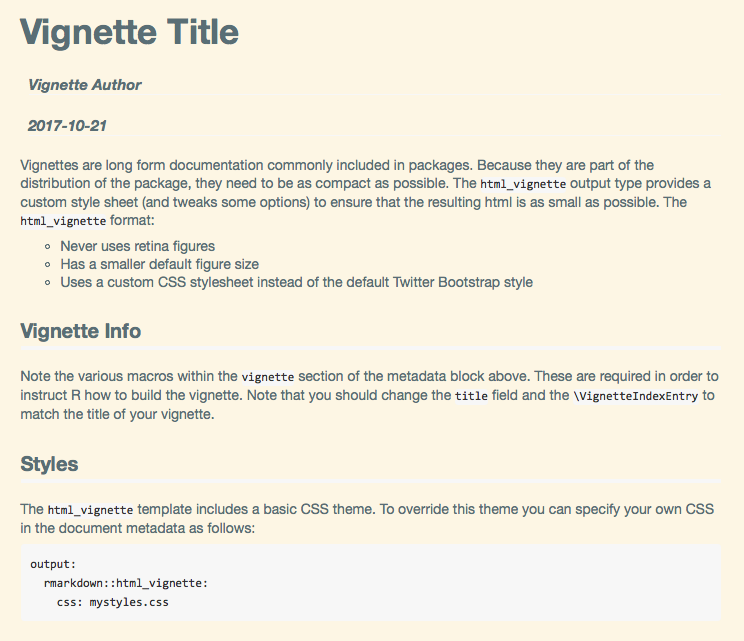
```
