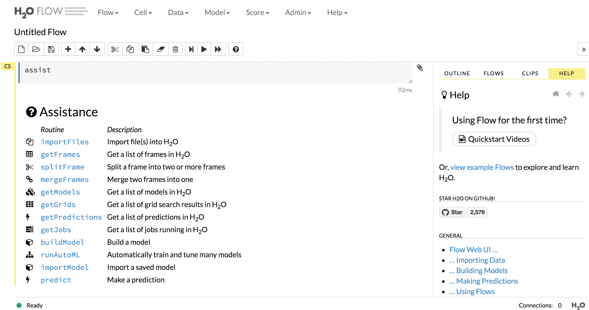
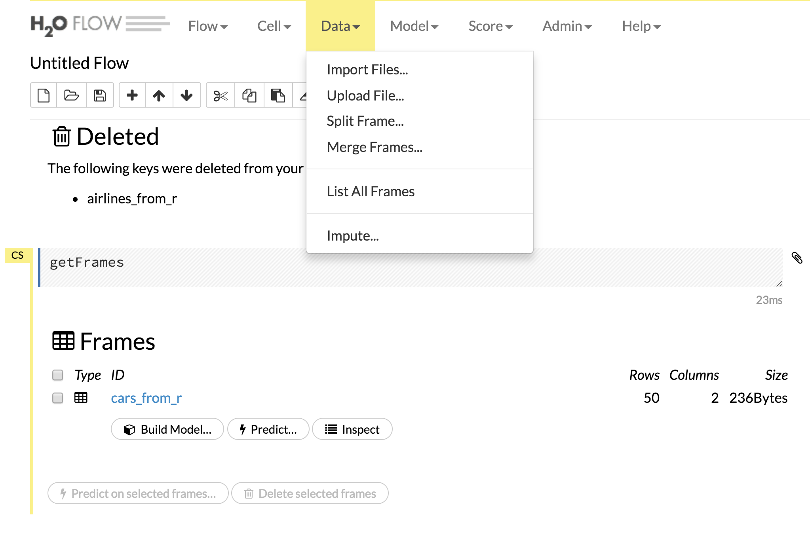
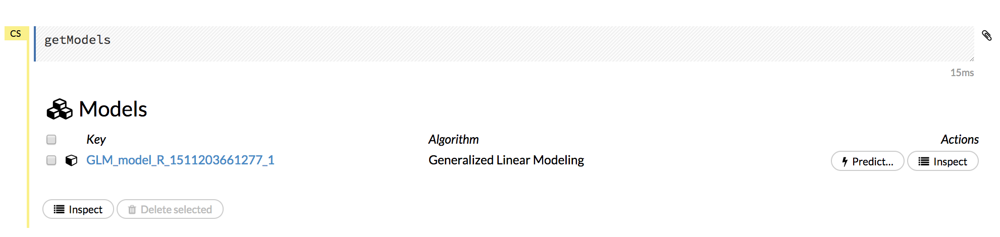
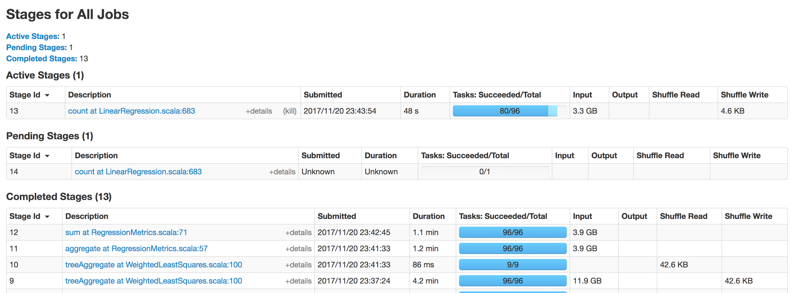

# Big data {#bigdata}

## How to deal with (very / too) large datasets?

1. Use more RAM / processors / drive space...
2. Use less data: (re)sample, ...
3. Use a database
4. Use specific R packages (`ff`, `bigmemory`)
5. Use other tools

## How big is big?

1. Fits in RAM and on drive (but slow)
2. Doesn't fit in RAM but fits on drive
3. Doesn't fit in RAM and doesn't fit on drive

## List of tools

Reading: @Varian2014 ([PDF available](http://pubs.aeaweb.org/doi/pdfplus/10.1257/jep.28.2.3))

```{r echo=FALSE, fig.align="center", tool_list, fig.cap=""}
knitr::include_graphics("images/ch6_tool_list.png")
```

Spark?  h2o?  More?  Let's go back to the bottlenecks

- CPU
- RAM
- I/O

## Data that fits in memory

### Faster I/O

Reading: https://cran.r-project.org/web/packages/data.table/vignettes/datatable-intro.html

`data.table` provides an enhanced of a `data.frame` and faster I/O with `fread` and `fwrite`.

To read the 0.5GB ratings file from MovieLens

```{r eval=FALSE}
library(data.table)
system.time(ratings <- fread("~/Dropbox/Data17/ml-20m/ratings.csv"))
```

takes

```{txt}
Read 20000263 rows and 4 (of 4) columns from 0.497 GB file in 00:00:05
   user  system elapsed 
  4.007   0.229   4.244
```

while

```{r eval=FALSE}
system.time(ratings <- read.csv("~/Dropbox/Data17/ml-20m/ratings.csv"))
```

takes

```{txt}
   user  system elapsed 
 85.199   2.711  90.997 
```

There are ways to improve the speed of `read.csv` (for example, but specifying column types).  But in general `fread` is much faster.

```{r eval=FALSE}
library(readr) # in tidyverse
system.time(ratings <- read_csv("~/Dropbox/Data17/ml-20m/ratings.csv"))
```

```{txt}
   user  system elapsed 
 10.290   3.037  18.450 
```

also tends to perform better than `read.csv`.

```{r echo = FALSE, results = 'asis'}
library(knitr)
tools <- data.frame("package" = c("base", "data.table", "readr"),
                    "function" = c("read.csv", "fread", "read_csv"),
                    "speed" = c("slow", "very fast", "fast"),
                    "output" = c("data.frame", "data.table", "tibble"))
kable(tools, caption = "I/O comparison")
```

### Reference vs copy

Reading: http://adv-r.had.co.nz/memory.html
Reading: https://jangorecki.gitlab.io/data.table/library/data.table/html/assign.html

```{r eval=FALSE}
library(pryr)
library(data.table)

d <- read.csv("~/Dropbox/Data17/ml-latest-small/ratings.csv")
D <- fread("~/Dropbox/Data17/ml-latest-small/ratings.csv")

object_size(d)
object_size(D)

mem_change(d$Idx <- 1:nrow(d))
mem_change(D[, Idx:= 1:.N])

object_size(d$Idx)
object_size(D$Idx)
```

```{r eval=FALSE}
d <- read.csv("~/Dropbox/Data17/ml-latest-small/ratings.csv")
D <- fread("~/Dropbox/Data17/ml-latest-small/ratings.csv")

.Internal(inspect(d))
d$Idx <- 1:nrow(d)
.Internal(inspect(d))

.Internal(inspect(D))
D[, Idx:= 1:.N]
.Internal(inspect(D))
```

### data.table: another data manipulation grammar

Reading: https://cran.r-project.org/web/packages/data.table/vignettes/datatable-intro.html

```{exercise}
Benchmark adding a column to a large data frame vs a large data table.
```

## Data that doesn't fit in memory (but fits on drive)

Let's try to work with a 12GB file and 4/8 GB of memory...

## Pure R solutions

### A regressions example

```{r eval=FALSE}
library(data.table)
airlines <- fread("/Users/cchoirat/Dropbox/Data17/AirFlights/allyears2k.csv")
rfit <- lm(ArrDelay ~ Distance, data = airlines)
summary(rfit)
```

### Sampling

- Read the data (even line by line)
- Select a sample of rows
- Run your model on the random sample

### `bigmemory`

https://cran.r-project.org/web/packages/bigmemory/index.html

Reading: https://cran.r-project.org/web/packages/bigmemory/vignettes/Overview.pdf

__bigmemory__: Manage Massive Matrices with Shared Memory and Memory-Mapped Files

Create, store, access, and manipulate massive matrices. Matrices are allocated to shared memory and may use memory-mapped files. Packages 'biganalytics', 'bigtabulate', 'synchronicity', and 'bigalgebra' provide advanced functionality.

__(+)__ pure R solution from a user perspective

__(-)__ mostly for numeric data matrices, mostly to speed up computations on data of +/- RAM size


```{r eval=FALSE}
library(bigmemory)
library(biganalytics)
# library(bigtabulate)
# library(biglm)

flights <- read.big.matrix(
  "/Users/cchoirat/Dropbox/Data17/AirFlights/allyears2k.csv",
  header = TRUE,
  backingfile = "allyears2k.bin",
  backingpath = "/Users/cchoirat/Dropbox/Data17/AirFlights/",
  descriptorfile = "allyears2k.desc",
  shared = TRUE)

air_flights <- attach.big.matrix("/Users/cchoirat/Dropbox/Data17/AirFlights/allyears2k.desc")
dim(air_flights)
colnames(air_flights)
mean(air_flights[, "ArrDelay"], na.rm = TRUE)

fit <- biglm.big.matrix(ArrDelay ~ Distance, data = air_flights)
fit
summary(fit)
```

### Database connections and lazy evaluation

```{r eval=FALSE}
library(data.table)
D <- fread("~/Dropbox/Data17/ml-20m/ratings.csv")

library(sqldf)
read.csv.sql(file = "~/Dropbox/Data17/ml-20m/ratings.csv",
             sql = c("ATTACH 'ratings.sqlite3' AS NEW"))
read.csv.sql(file = "~/Dropbox/Data17/ml-20m/ratings.csv",
             sql = "CREATE TABLE ratings_table AS SELECT * FROM file",
             dbname = "ratings.sqlite3")

library(dplyr)
library(DBI)

con <- DBI::dbConnect(RSQLite::SQLite(), dbname = "ratings.sqlite3")

ratings_db <- tbl(con, "ratings_table")
ratings_db %>% 
  select(ends_with("Id")) %>% 
  filter(movieId < 100)

```

```{r eval=FALSE}
# Source:   lazy query [?? x 2]
# Database: sqlite 3.19.3
#   [/Users/cchoirat/Documents/LocalGit/bigdata17/ratings.sqlite3]
   userId movieId
    <int>   <int>
 1      1       2
 2      1      29
 3      1      32
 4      1      47
 5      1      50
 6      2       3
 7      2      62
 8      2      70
 9      3       1
10      3      24
# ... with more rows
# ... with more rows
```

```{r eval=FALSE}
ratings_db %>% 
  select(ends_with("Id")) %>% 
  filter(movieId < 100) %>% 
  collect()
```

```{r eval=FALSE}
# A tibble: 790,226 x 2
   userId movieId
    <int>   <int>
 1      1       2
 2      1      29
 3      1      32
 4      1      47
 5      1      50
 6      2       3
 7      2      62
 8      2      70
 9      3       1
10      3      24
# ... with 790,216 more rows
```

## Scaling up

## Parallel computing and clusters

## Cloud computing

More soon with the Odyssey guest lecture (https://www.rc.fas.harvard.edu/odyssey/).

## `h2o`: "Fast Scalable Machine Learning"

http://www.h2o.ai/

http://www.r-bloggers.com/scalable-machine-learning-for-big-data-using-r-and-h2o/

http://venturebeat.com/2014/11/07/h2o-funding/
https://www.h2o.ai/driverless-ai/
https://www.infoworld.com/article/3236048/machine-learning/review-h2oai-automates-machine-learning.html

### Ecosystem

Readings:

- http://docs.h2o.ai/h2o/latest-stable/h2o-docs/welcome.html

- http://www.h2o.ai/download/h2o/r

- https://cran.r-project.org/web/packages/h2o/index.html

> To build H2O or run H2O tests, the 64-bit JDK is required.
>
> To run the H2O binary using either the command line, R, or Python packages, only 64-bit JRE is required.

```{r eval=FALSE}
if ("package:h2o" %in% search()) { detach("package:h2o", unload=TRUE) }
if ("h2o" %in% rownames(installed.packages())) { remove.packages("h2o") }
install.packages("h2o")
```

## Running h20 locally within R

```{r eval=FALSE}
library(h2o)
localH2O <- h2o.init(min_mem_size = "20g")
```

```{r eval=FALSE}
# h2o.init(ip = "localhost", port = 54321, startH2O = TRUE,
#          forceDL = FALSE, enable_assertions = TRUE, license = NULL,
#          nthreads = -2, max_mem_size = NULL, min_mem_size = NULL,
#          ice_root = tempdir(), strict_version_check = TRUE,
#          proxy = NA_character_, https = FALSE, insecure = FALSE,
#          username = NA_character_, password = NA_character_)
```

```{r eval=FALSE}
 Connection successful!

R is connected to the H2O cluster: 
    H2O cluster uptime:         19 days 12 hours 
    H2O cluster version:        3.14.0.3 
    H2O cluster version age:    1 month and 24 days  
    H2O cluster name:           H2O_started_from_R_cchoirat_bgt310 
    H2O cluster total nodes:    1 
    H2O cluster total memory:   15.18 GB 
    H2O cluster total cores:    8 
    H2O cluster allowed cores:  8 
    H2O cluster healthy:        TRUE 
    H2O Connection ip:          localhost 
    H2O Connection port:        54321 
    H2O Connection proxy:       NA 
    H2O Internal Security:      FALSE 
    H2O API Extensions:         XGBoost, Algos, AutoML, Core V3, Core V4 
    R Version:                  R version 3.4.2 (2017-09-28) 
```

## JVM (from Wikipedia)

A Java virtual machine (JVM) is an abstract computing machine that enables a computer to run a Java program. There are three notions of the JVM: specification, implementation, and instance. The specification is a document that formally describes what is required of a JVM implementation.

(https://en.wikipedia.org/wiki/Java_virtual_machine)

## Which languages? (from Wikipedia)

This list of JVM Languages comprises notable computer programming languages that are used to produce software that runs on the Java Virtual Machine (JVM). Some of these languages are interpreted by a Java program, and some are compiled to Java bytecode and JIT-compiled during execution as regular Java programs to improve performance.

## Which languages?

https://en.wikipedia.org/wiki/List_of_JVM_languages

- Java
- Scala, an object-oriented and functional programming language
- Jython
- R (an implementation of R: https://en.wikipedia.org/wiki/Renjin)
- ...

## State of the h2o JVM

```{r eval=FALSE}
h2o.clusterInfo()
```

```{r eval=FALSE}
R is connected to the H2O cluster: 
    H2O cluster uptime:         19 days 13 hours 
    H2O cluster version:        3.14.0.3 
    H2O cluster version age:    1 month and 24 days  
    H2O cluster name:           H2O_started_from_R_cchoirat_bgt310 
    H2O cluster total nodes:    1 
    H2O cluster total memory:   15.18 GB 
    H2O cluster total cores:    8 
    H2O cluster allowed cores:  8 
    H2O cluster healthy:        TRUE 
    H2O Connection ip:          localhost 
    H2O Connection port:        54321 
    H2O Connection proxy:       NA 
    H2O Internal Security:      FALSE 
    H2O API Extensions:         XGBoost, Algos, AutoML, Core V3, Core V4 
    R Version:                  R version 3.4.2 (2017-09-28) 
```

Let's check http://localhost:54321/flow/index.html.

```{r echo=FALSE, fig.align="center", h2o_flow}

```

### Importing data into h2o from the R session

```{r eval=FALSE}
data(cars)
cars_to_h2o <- as.h2o(cars, destination_frame = "cars_from_r")
is.data.frame(cars_to_h2o) # FALSE
class(cars_to_h2o) # H2OFrame
```

(No persistence beyond the R session when h2O is started from R.)

### h2o functions

```{r eval=FALSE}
summary(cars_to_h2o) # actually calls h2o:::summary.H2OFrame(cars_to_h2o)
```

```{r eval=FALSE}
Approximated quantiles computed! If you are interested in exact quantiles, please pass the `exact_quantiles=TRUE` parameter. speed          dist            
 Min.   : 4.0   Min.   :  2.00  
 1st Qu.:12.0   1st Qu.: 26.00  
 Median :15.0   Median : 36.00  
 Mean   :15.4   Mean   : 42.98  
 3rd Qu.:19.0   3rd Qu.: 56.00  
 Max.   :25.0   Max.   :120.00  
```

### Let's check from the h2o JVM

From the browser: 'Data' -> 'List All Frames'

```{r echo=FALSE, fig.align="center", h2o_list_data}

```

### Importing data into h2o from disk

```{r eval=FALSE}
airlines_path <- "/Users/cchoirat/Dropbox/Data17/AirFlights/allyears2k.csv" # full path
airlines_to_h2o <- h2o.importFile(path = airlines_path,
                                  destination_frame = "airlines_from_r")
summary(airlines_to_h2o)
```

### Running a statistical model

```{r eval=FALSE}
h2ofit <- h2o.glm(y = "ArrDelay", x = "Distance",
                  training_frame = airlines_to_h2o,
                  intercept = TRUE, # default is TRUE
                  family = "gaussian")
h2ofit
summary(h2ofit)
```

```{r eval=FALSE}
Coefficients: glm coefficients
      names coefficients standardized_coefficients
1 Intercept     7.702657                  9.308665
2  Distance     0.002199                  1.272253
```


```{r eval=FALSE}
airlines <- read.csv("~/Dropbox/Data17/AirFlights/allyears2k.csv")
rfit <- lm(ArrDelay ~ Distance, data = airlines)
summary(rfit)
```

```{r eval=FALSE}
Coefficients:
             Estimate Std. Error t value Pr(>|t|)    
(Intercept) 7.7011553  0.2326198  33.106   <2e-16 ***
Distance    0.0022045  0.0002487   8.865   <2e-16 ***
```

### `h2o` models

```{r echo=FALSE, fig.align="center", h2o_models}

```


### Closing the h2o session

```{r eval=FALSE}
h2o.shutdown()
```

### Available algorithms

- Deep learning
- Distributed randon forest
- Gradient boosting method
- Generalized linear modeling
- Generalized low rank modeling
- K-means
- Naive Bayes
- Principal component analysis

### How to incorporate new models in h2o?

__(+)__ built-in models behave very much like R and are scalable

__(-)__ not easy to extend (*e.g*., GLM https://github.com/h2oai/h2o-3/blob/master/h2o-algos/src/main/java/hex/glm/GLM.java)

```{exercise}
Run the same analysis with the whole dataset `allyears.csv`.
```

## Spark

Reading: https://spark.rstudio.com/

```{r eval=FALSE}
library(sparklyr)
spark_install(version = "2.1.0")
```

```{r eval=FALSE}
conf <- spark_config()
conf$`sparklyr.shell.driver-memory` <- "32G"
conf$spark.memory.fraction <- 0.5
sc <- spark_connect(master = "local")
```

```{r eval=FALSE}
library(dplyr)
iris_tbl <- copy_to(sc, iris)
flights_tbl <- copy_to(sc, nycflights13::flights, "flights")
batting_tbl <- copy_to(sc, Lahman::Batting, "batting")
src_tbls(sc)
```

```{r eval=FALSE}
[1] "batting" "flights" "iris"
```

You can use SQL:

```{r eval=FALSE}
library(DBI)
iris_preview <- dbGetQuery(sc, "SELECT * FROM iris LIMIT 10")
```

Like h2o, you can open a web interface:

```{r eval=FALSE}
spark_web(sc)
```


```{r eval=FALSE}
top_rows <- read.csv("~/Dropbox/Data17/AirFlights/allyears.csv", nrows = 5)
file_columns <- top_rows %>% 
  purrr::map(function(x)"character")
rm(top_rows)
```

```{r eval=FALSE}
sp_flights <- spark_read_csv(sc, 
                             name = "flights2", 
                             path = "~/Dropbox/Data17/AirFlights/allyears.csv", 
                             memory = FALSE, 
                             columns = file_columns, 
                             infer_schema = FALSE)
```

```{r eval=FALSE}
# Source:   table<flights2> [?? x 31]
# Database: spark_connection
    Year Month DayofMonth DayOfWeek DepTime CRSDepTime ArrTime CRSArrTime UniqueCarrier
   <chr> <chr>      <chr>     <chr>   <chr>      <chr>   <chr>      <chr>         <chr>
 1  1987    10         14         3     741        730     912        849            PS
 2  1987    10         15         4     729        730     903        849            PS
 3  1987    10         17         6     741        730     918        849            PS
 4  1987    10         18         7     729        730     847        849            PS
 5  1987    10         19         1     749        730     922        849            PS
 6  1987    10         21         3     728        730     848        849            PS
 7  1987    10         22         4     728        730     852        849            PS
 8  1987    10         23         5     731        730     902        849            PS
 9  1987    10         24         6     744        730     908        849            PS
10  1987    10         25         7     729        730     851        849            PS
# ... with more rows, and 22 more variables: FlightNum <chr>, TailNum <chr>,
#   ActualElapsedTime <chr>, CRSElapsedTime <chr>, AirTime <chr>, ArrDelay <chr>,
#   DepDelay <chr>, Origin <chr>, Dest <chr>, Distance <chr>, TaxiIn <chr>,
#   TaxiOut <chr>, Cancelled <chr>, CancellationCode <chr>, Diverted <chr>,
#   CarrierDelay <chr>, WeatherDelay <chr>, NASDelay <chr>, SecurityDelay <chr>,
#   LateAircraftDelay <chr>, IsArrDelayed <chr>, IsDepDelayed <chr>
```

```{r eval=FALSE}
flights_table <- sp_flights %>%
  mutate(DepDelay = as.numeric(DepDelay),
         ArrDelay = as.numeric(ArrDelay),
         Distance = as.numeric(Distance),
         SchedDeparture = as.numeric(CRSDepTime)) %>%
  select(Origin, Dest, SchedDeparture, ArrDelay, DepDelay, Month, DayofMonth, Distance)

flights_table %>% head
```

Cache data:

```{r eval=FALSE}
sp_flights %>%
  tally # takes a looooong time
```

123534969...

```{r eval=FALSE}
# might take a while...
subset_table <- flights_table %>% 
  compute("flights_subset")
```

```{r eval=FALSE}
subset_table %>%
  tally # a bit faster.
```

123534969 as well!

### Run a statistical model

```{r eval=FALSE}
# small_flights <- spark_read_csv(sc, 
#                              name = "flights2", 
#                              path = "~/Dropbox/Data17/AirFlights/allyears2k.csv", 
#                              memory = FALSE, 
#                              columns = file_columns, 
#                              infer_schema = FALSE)
```

```{r eval=FALSE}
# small_flights_table <- small_flights %>%
#   mutate(DepDelay = as.numeric(DepDelay),
#          ArrDelay = as.numeric(ArrDelay),
#          Distance = as.numeric(Distance),
#          SchedDeparture = as.numeric(CRSDepTime)) %>%
#   select(Origin, Dest, SchedDeparture, ArrDelay, DepDelay, Month, DayofMonth, Distance)
# 
# small_flights_table %>% head
```

```{r eval=FALSE}
# lm(arr_delay ~ distance, data = flights_tbl)
 ml_linear_regression(flights_table, response = "ArrDelay", features = "Distance")
```

```{r eval=FALSE}
Coefficients:
 (Intercept)     Distance 
6.9707048955 0.0001100521
```


```{r echo=FALSE, fig.align="center", spark_jobs, fig.cap=""}

```

### Deployment

Reading: https://spark.rstudio.com/deployment.html

## `Sparkling Water`

Reading: https://spark.rstudio.com/h2o.html

## Adding new models to `h2o` and `spark`

## More?

GPU
