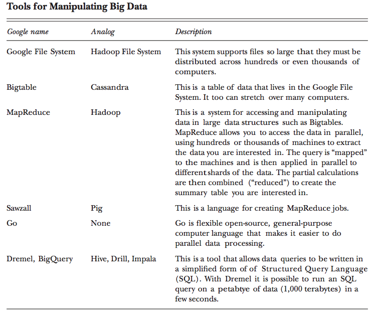

# Big data {#bigdata}

## How to deal with (very / too) large datasets?

1. Use more RAM / processors / drive space...
2. Use less data: (re)sample, ...
3. Use a database
4. Use specific R packages (`ff`, `bigmemory`)
5. Use other tools

## How big is big?

1. Fits in RAM and on drive (but slow)
2. Doesn't fit in RAM but fits on drive
3. Doesn't fit in RAM and doesn't fit on drive

## List of tools

Reading: @Varian2014 ([PDF available](http://pubs.aeaweb.org/doi/pdfplus/10.1257/jep.28.2.3))

```{r echo=FALSE, fig.align="center", tool_list, fig.cap=""}

```

Spark?  h2o?  More?  Let's go back to the bottlenecks

- CPU
- RAM
- I/O

## Data that fits in memory

### Faster I/O

Reading: https://cran.r-project.org/web/packages/data.table/vignettes/datatable-intro.html

`data.table` provides an enhanced of a `data.frame` and faster I/O with `fread` and `fwrite`.

To read the 0.5GB ratings file from MovieLens

```{r eval=FALSE}
library(data.table)
system.time(ratings <- fread("~/Dropbox/Data17/ml-20m/ratings.csv"))
```

takes

```{txt}
Read 20000263 rows and 4 (of 4) columns from 0.497 GB file in 00:00:05
   user  system elapsed 
  4.007   0.229   4.244
```

while

```{r eval=FALSE}
system.time(ratings <- read.csv("~/Dropbox/Data17/ml-20m/ratings.csv"))
```

takes

```{txt}
   user  system elapsed 
 85.199   2.711  90.997 
```

There are ways to improve the speed of `read.csv` (for example, but specifying column types).  But in general `fread` is much faster.

```{r eval=FALSE}
library(readr) # in tidyverse
system.time(ratings <- read_csv("~/Dropbox/Data17/ml-20m/ratings.csv"))
```

```{txt}
   user  system elapsed 
 10.290   3.037  18.450 
```

also tends to perform better than `read.csv`.

```{r echo = FALSE, results = 'asis'}
library(knitr)
tools <- data.frame("package" = c("base", "data.table", "readr"),
                    "function" = c("read.csv", "fread", "read_csv"),
                    "speed" = c("slow", "very fast", "fast"),
                    "output" = c("data.frame", "data.table", "tibble"))
kable(tools, caption = "I/O comparison")
```

### Reference vs copy

Reading: http://adv-r.had.co.nz/memory.html
Reading: https://jangorecki.gitlab.io/data.table/library/data.table/html/assign.html

```{r eval=FALSE}
library(pryr)
library(data.table)

d <- read.csv("~/Dropbox/Data17/ml-latest-small/ratings.csv")
D <- fread("~/Dropbox/Data17/ml-latest-small/ratings.csv")

object_size(d)
object_size(D)

mem_change(d$Idx <- 1:nrow(d))
mem_change(D[, Idx:= 1:.N])

object_size(d$Idx)
object_size(D$Idx)
```

```{r eval=FALSE}
d <- read.csv("~/Dropbox/Data17/ml-latest-small/ratings.csv")
D <- fread("~/Dropbox/Data17/ml-latest-small/ratings.csv")

.Internal(inspect(d))
d$Idx <- 1:nrow(d)
.Internal(inspect(d))

.Internal(inspect(D))
D[, Idx:= 1:.N]
.Internal(inspect(D))
```

### data.table: another data manipulation grammar

Reading: https://cran.r-project.org/web/packages/data.table/vignettes/datatable-intro.html

```{exercise}
Benchmark adding a column to a large data frame vs a large data table.
```

## Data that doesn't fit in memory (but fits on drive)

Let's try to work with a 12GB file and 4/8 GB of memory...

## Pure R solutions

### A regressions example

```{r eval=FALSE}
library(data.table)
airlines <- fread("/Users/cchoirat/Dropbox/Data17/AirFlights/allyears2k.csv")
rfit <- lm(ArrDelay ~ Distance, data = airlines)
summary(rfit)
```

### Sampling

- Read the data (even line by line)
- Select a sample of rows
- Run your model on the random sample

### `bigmemory`

https://cran.r-project.org/web/packages/bigmemory/index.html

Reading: https://cran.r-project.org/web/packages/bigmemory/vignettes/Overview.pdf

__bigmemory__: Manage Massive Matrices with Shared Memory and Memory-Mapped Files

Create, store, access, and manipulate massive matrices. Matrices are allocated to shared memory and may use memory-mapped files. Packages 'biganalytics', 'bigtabulate', 'synchronicity', and 'bigalgebra' provide advanced functionality.

__(+)__ pure R solution from a user perspective

__(-)__ mostly for numeric data matrices, mostly to speed up computations on data of +/- RAM size


```{r eval=FALSE}
library(bigmemory)
library(biganalytics)
# library(bigtabulate)
# library(biglm)

flights <- read.big.matrix(
  "/Users/cchoirat/Dropbox/Data17/AirFlights/allyears2k.csv",
  header = TRUE,
  backingfile = "allyears2k.bin",
  backingpath = "/Users/cchoirat/Dropbox/Data17/AirFlights/",
  descriptorfile = "allyears2k.desc",
  shared = TRUE)

air_flights <- attach.big.matrix("/Users/cchoirat/Dropbox/Data17/AirFlights/allyears2k.desc")
dim(air_flights)
colnames(air_flights)
mean(air_flights[, "ArrDelay"], na.rm = TRUE)

fit <- biglm.big.matrix(ArrDelay ~ Distance, data = air_flights)
fit
summary(fit)
```

### Database connections and lazy evaluation

```{r eval=FALSE}
D <- fread("~/Dropbox/Data17/AirFlights/")
```


## Scaling up

## Parallel computing and clusters

## Cloud computing

More soon with the Odyssey guest lecture (https://www.rc.fas.harvard.edu/odyssey/).

## `h2o`: "Fast Scalable Machine Learning"

http://www.h2o.ai/

http://www.r-bloggers.com/scalable-machine-learning-for-big-data-using-r-and-h2o/

http://venturebeat.com/2014/11/07/h2o-funding/
https://www.h2o.ai/driverless-ai/
https://www.infoworld.com/article/3236048/machine-learning/review-h2oai-automates-machine-learning.html

### Ecosystem

Readings:

- http://docs.h2o.ai/h2o/latest-stable/h2o-docs/welcome.html

- http://www.h2o.ai/download/h2o/r

- https://cran.r-project.org/web/packages/h2o/index.html

> To build H2O or run H2O tests, the 64-bit JDK is required.
>
> To run the H2O binary using either the command line, R, or Python packages, only 64-bit JRE is required.

```{r eval=FALSE}
if ("package:h2o" %in% search()) { detach("package:h2o", unload=TRUE) }
if ("h2o" %in% rownames(installed.packages())) { remove.packages("h2o") }
install.packages("h2o")
```

## Running h20 locally within R

```{r eval=FALSE}
library(h2o)
localH2O <- h2o.init(min_mem_size = "20g")
```

```{r eval=FALSE}
# h2o.init(ip = "localhost", port = 54321, startH2O = TRUE,
#          forceDL = FALSE, enable_assertions = TRUE, license = NULL,
#          nthreads = -2, max_mem_size = NULL, min_mem_size = NULL,
#          ice_root = tempdir(), strict_version_check = TRUE,
#          proxy = NA_character_, https = FALSE, insecure = FALSE,
#          username = NA_character_, password = NA_character_)
```

(No persistence beyond the R session when h2O is started from R.)

## State of the JVM

```{r eval=FALSE}
h2o.clusterInfo()
```

Let's check http://localhost:54321/.

## Spark

Reading: https://spark.rstudio.com/

```{r eval=FALSE}
library(sparklyr)
spark_install(version = "2.1.0")
```

```{r eval=FALSE}
conf <- spark_config()
conf$`sparklyr.shell.driver-memory` <- "32G"
conf$spark.memory.fraction <- 0.5
sc <- spark_connect(master = "local")
```

```{r eval=FALSE}
library(dplyr)
iris_tbl <- copy_to(sc, iris)
flights_tbl <- copy_to(sc, nycflights13::flights, "flights")
batting_tbl <- copy_to(sc, Lahman::Batting, "batting")
src_tbls(sc)
```

```{r eval=FALSE}
top_rows <- read.csv("~/Dropbox/Data17/AirFlights/allyears.csv", nrows = 5)
file_columns <- top_rows %>% 
  purrr::map(function(x)"character")
rm(top_rows)
```

```{r eval=FALSE}
sp_flights <- spark_read_csv(sc, 
                             name = "flights2", 
                             path = "~/Dropbox/Data17/AirFlights/allyears.csv", 
                             memory = FALSE, 
                             columns = file_columns, 
                             infer_schema = FALSE)
```

```{r eval=FALSE}
flights_table <- sp_flights %>%
  mutate(DepDelay = as.numeric(DepDelay),
         ArrDelay = as.numeric(ArrDelay),
         SchedDeparture = as.numeric(CRSDepTime)) %>%
  select(Origin, Dest, SchedDeparture, ArrDelay, DepDelay, Month, DayofMonth)

flights_table %>% head
```

Cache data:

```{r eval=FALSE}
sp_flights %>%
  tally # takes a looooong time
```

123534969...

```{r eval=FALSE}
subset_table <- flights_table %>% 
  compute("flights_subset")
```

```{r eval=FALSE}
subset_table %>%
  tally # a bit faster.
```

123534969 as well!

```{r eval=FALSE}
lm(arr_delay ~ distance, data = flights_tbl)
ml_linear_regression(subset_table, response = "ArrDelay", features = "SchedDeparture")
```

TODOL change the `config` arguments of the connection

## `Sparkling Water`

Reading: https://spark.rstudio.com/h2o.html

### More?

GPU
