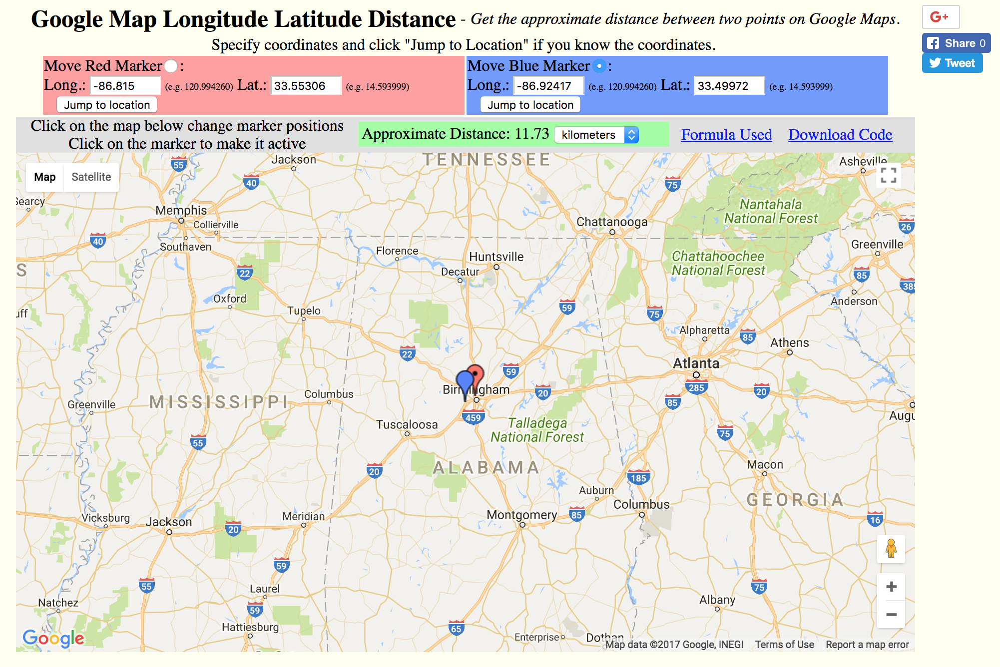

# Visualization {#visualization}

## Maps and GIS

GIS: **G**eographic **I**nformation **S**ystem

Readings:

- https://bookdown.org/robinlovelace/geocompr/intro.html

- @Bivand2013

- http://rspatial.org/index.html

- http://www.spatialecology.com/beyer/assets/Beyer_Introduction_to_geospatial_analysis_in_R.pdf

### Longitudes, latitudes and CRS

Reading: https://www.nceas.ucsb.edu/~frazier/RSpatialGuides/OverviewCoordinateReferenceSystems.pdf

CRS: **C**oordinate **R**eference **S**ystem

EPSG Geodetic Parameter Dataset: structured dataset of Coordinate Reference Systems and Coordinate Transformations (http://www.epsg-registry.org/)

### Vector data and shapefiles

Reading: https://bookdown.org/robinlovelace/geocompr/spatial-data-operations.html#spatial-operations-on-vector-data

### Raster data

Reading: https://bookdown.org/robinlovelace/geocompr/spatial-data-operations.html#spatial-operations-on-raster-data

### Backends

#### `GDAL`

GDAL: **G**eospatial **D**ata **A**bstraction **L**ibrary

https://en.wikipedia.org/wiki/GDAL#Software_using_GDAL/OGR

#### `GEOS`

GEOS: **G**eometry **E**ngine - **O**pen **S**ource

https://en.wikipedia.org/wiki/JTS_Topology_Suite#Applications_Using_GEOS

### R as a GIS: packages

https://cran.r-project.org/web/packages/sp/

#### `rgdal`

`rgdal`: Bindings for the 'Geospatial' Data Abstraction Library

Provides bindings to the 'Geospatial' Data Abstraction Library ('GDAL') (>= 1.6.3) and access to projection/transformation operations from the 'PROJ.4' library. The 'GDAL' and 'PROJ.4' libraries are external to the package, and, when installing the package from source, must be correctly installed first. Both 'GDAL' raster and 'OGR' vector map data can be imported into R, and 'GDAL' raster data and 'OGR' vector data exported. Use is made of classes defined in the 'sp' package. Windows and Mac Intel OS X binaries (including 'GDAL', 'PROJ.4' and 'Expat') are provided on 'CRAN'.

https://cran.r-project.org/web/packages/rgdal/

#### `rgeos`

`rgeos`: Interface to Geometry Engine - Open Source ('GEOS')

Interface to Geometry Engine - Open Source ('GEOS') using the C 'API' for topology operations on geometries. The 'GEOS' library is external to the package, and, when installing the package from source, must be correctly installed first. Windows and Mac Intel OS X binaries are provided on 'CRAN'.

https://cran.r-project.org/web/packages/rgeos/

#### `proj4`

`proj4`: A simple interface to the PROJ.4 cartographic projections library

A simple interface to lat/long projection and datum transformation of the PROJ.4 cartographic projections library. It allows transformation of geographic coordinates from one projection and/or datum to another.

https://cran.r-project.org/web/packages/proj4/

#### `sf`

`sf`: Simple Features for R

Support for simple features, a standardized way to encode spatial vector data. Binds to GDAL for reading and writing data, to GEOS for geometrical operations, and to Proj.4 for projection conversions and datum transformations.

https://cran.r-project.org/web/packages/sf/

#### `sp`

`sp`: Classes and Methods for Spatial Data

Classes and methods for spatial data; the classes document where the spatial location information resides, for 2D or 3D data. Utility functions are provided, e.g. for plotting data as maps, spatial selection, as well as methods for retrieving coordinates, for subsetting, print, summary, etc.

https://cran.r-project.org/web/packages/sp/

#### `ggmap`

`ggmap`: Spatial Visualization with ggplot2

A collection of functions to visualize spatial data and models on top of static maps from various online sources (e.g Google Maps and Stamen Maps). It includes tools common to those tasks, including functions for geolocation and routing.

https://cran.r-project.org/web/packages/ggmap/

#### `leaflet`

`leaflet`: Create Interactive Web Maps with the JavaScript 'Leaflet' Library

Create and customize interactive maps using the 'Leaflet' JavaScript library and the 'htmlwidgets' package. These maps can be used directly from the R console, from 'RStudio', in Shiny apps and R Markdown documents.

https://cran.r-project.org/web/packages/leaflet/

https://rstudio.github.io/leaflet/

#### Pythonic world

https://pypi.python.org/pypi/GDAL

https://pypi.python.org/pypi/geos

### Example

US: https://www.youtube.com/watch?v=qu6TiwvjPLs

Europe: https://www.youtube.com/watch?v=TYqsa5EvFe4

Power plants and air pollution monitors

https://github.com/datasciencelabs/data/blob/master/powerplants.csv

https://github.com/datasciencelabs/data/blob/master/pm25.csv

```{r message=FALSE, warning=FALSE}
power_plants <- read.csv("https://raw.githubusercontent.com/datasciencelabs/data/master/powerplants.csv")[, -1]
names(power_plants)[4] <- "so2"
pm25 <- read.csv("https://raw.githubusercontent.com/datasciencelabs/data/master/pm25.csv")[, -1]
names(pm25)[4] <- "pm"
```

```{r}
library(ggmap)
map <- get_map("US", zoom = 4)
p <- ggmap(map) +
  geom_point(data = power_plants, aes(x = lon1, y = lat1, alpha = so2), size = 5) +
  geom_point(data = pm25, aes(x = lon2, y = lat2), color = "red") 
  
p
```

#### Spatial objects

`power_plants` and `pm25` are data frames.  `ggmap` "guessed" how they should be displayed.

```{r}
class(power_plants)
```

```{r}
class(pm25)
```

We can convert data frames into spatial objects.  `plot` is still "guessing" the CRS.

```{r}
library(sp)
spm25 <- pm25
coordinates(spm25) <- ~lon2 + lat2
class(spm25)
plot(spm25)
```


```{r}
library(proj4)
proj4string(spm25)
```

```{r}
proj4string(spm25) <- CRS("+init=epsg:4269") # for most federal agencies NAD83 (EPSG:4269) 
proj4string(spm25)
plot(spm25)
```

```{r}
head(spm25)
head(spTransform(spm25, CRS("+init=epsg:3857")), 3) # Mercator: Google map
plot(spTransform(spm25, CRS("+init=epsg:3857")))
```

#### Spatial operations

```{r}
spm25[1, ]
spm25[2, ]
p1 <- spm25[1, ]
p2 <- spm25[2, ]
spDistsN1(p1, p2, longlat=TRUE) # longlat TRUE to get km
# m <- spDists(p1, spm25, longlat=TRUE) # to get all pairwise distances
```

Let's check: http://www.tytai.com/gmap/distance/.

```{r echo=FALSE, fig.align="center", distance_check, fig.cap=""}

```

```{r}
library(spdep)
kn <- knn2nb(knearneigh(spm25, k = 5))
kn[1] # 3   4 304 306 308
pm25[unlist(kn[1]), ]
```

#### Polygons

In which states are the PM2.5 monitors?

```{r eval=FALSE}
library(tigris)
library(raster)
s <- states(cb = TRUE, year = 2010)
shapefile(s, "~/Dropbox/Data17/census/census.shp")
```


```{r message=FALSE}
library(raster)
s <- shapefile("~/Dropbox/Data17/census/census.shp")
sort(unique(s@data$NAME))
s <- subset(s, ! NAME %in% c("Alaska", "Hawaii",  "Puerto Rico"))
plot(s)
proj4string(s)
proj4string(spm25)
spm25proj <- spTransform(spm25, proj4string(s))
proj4string(spm25proj)
o <- over(spm25proj, s)
odf <- data.frame(spm25@data , o)
head(odf)
```

#### Rasters

Let's get temperature data.

```{r}
library(raster)
temperatures <- getData("worldclim", var = "tmean", res = 10)
tmp_aug <- temperatures[[8]] # select August
plot(tmp_aug)

tmp_aug_state <- extract(tmp_aug, s, fun = mean, na.rm = TRUE, df = TRUE)
head(cbind(s@data$NAME, 0.1 * tmp_aug_state)) # 0.1 to get back to C

# tmp_aug_pp <- extract(tmp_aug, spm25, fun = mean, na.rm = TRUE, df = TRUE)
```

###  From `sp` to `sf`

Reading: https://github.com/r-spatial/sf/wiki/migrating

## Principles of visualization

Guest lecture (James Honaker)

