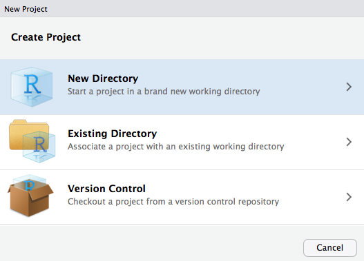
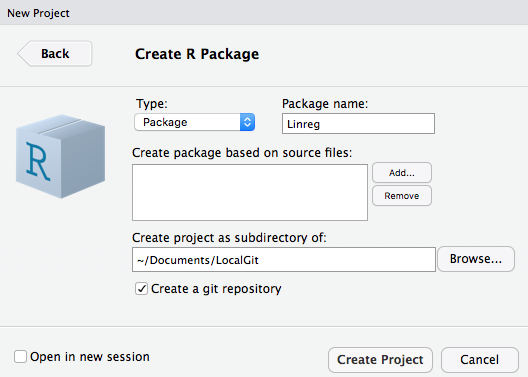
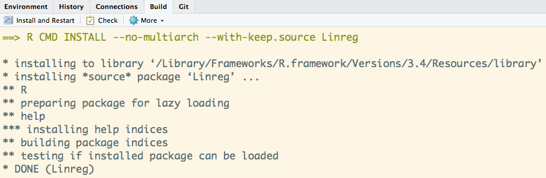
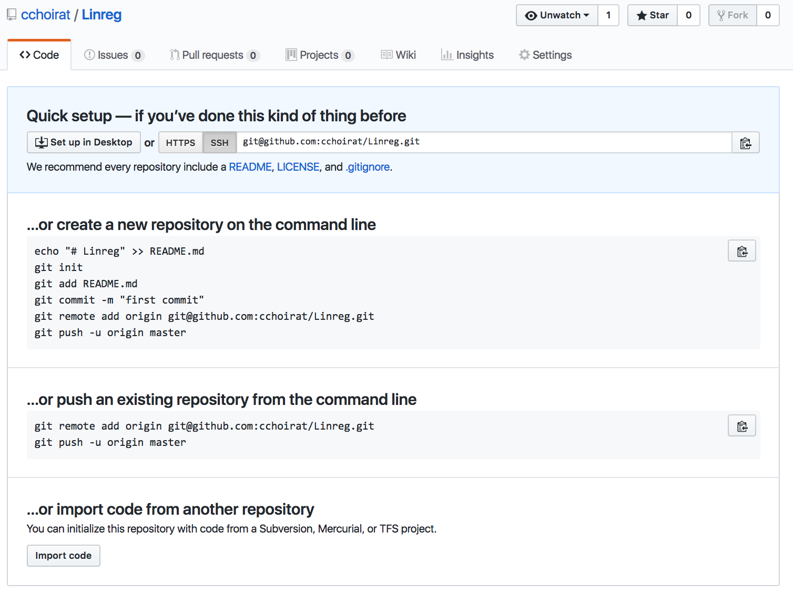
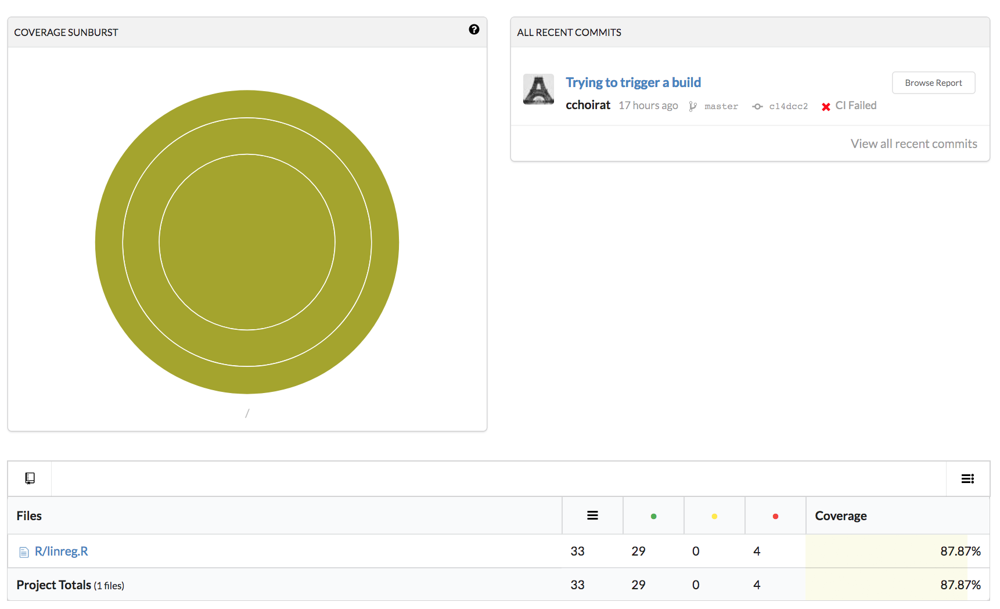

--- 
title: "Computing for Big Data (BST-262)"
author: "Christine Choirat"
date: "`r Sys.Date()`"
site: bookdown::bookdown_site
output: bookdown::gitbook
documentclass: book
bibliography: [book.bib, packages.bib]
biblio-style: apalike
link-citations: yes
github-repo: cchoirat/bigdata17
description: "Class notes for BST 262"
---


<!--chapter:end:index.Rmd-->

# Introduction {#intro}

## Logistics

- Fall 2 course
- Tuesday and Thursday, 11:30am-1pm
- Contact info: Christine Choirat (cchoirat@iq.harvard.edu).  Please use BST232 in the email title.
- TA's: Qian Di (qiandi@mail.harvard.edu) and Ben Sabath (mbsabath@hsph.harvard.edu)
- Office hours:
    - Ben: Tuesday 1:30-2:30pm
    - Qian:  Thursday 10:30-11:30am
    - Christine: Tuesday 10:30-11:30am (office 437A)
- Course GitHub repository https://github.com/cchoirat/bigdata17
- Open file in folder `_book/index.html`
- These course notes are **work in progress**.

## Prerequisites

For BST262 (Computing for Big Data), we assume familiarity with the material covered in BST260 (Introduction to Data Science).

We will use R to present concepts that are mostly language-agnostic.  We could have used Python, as in BST261 (Data Science II).

## Rationale

1. Available data grows at a much faster rate than available computing capacity.

2. Statistical software programs such as R were not designed to handle datasets of massive size.

## Big data bottlenecks

As described by @Lim2015, there are three bottlenecks:

- CPU
- RAM
- I/O

```{r echo=FALSE, fig.align="center", bottlenecks, fig.cap="Steps to execute an R program, from @Lim2015, Chapter 1."}
knitr::include_graphics("images/ch1_bottlenecks.png")
```
```{exercise}
Can you identify points 1--7 in the following code snippet?
```

```{r eval=FALSE}
data <- read.csv("mydata.csv")
totals <- colSums(data)
write.csv(totals, "totals.csv")
```

## Syllabus

Part I – Good code still matters _(even with lots of computing resources)_

Week 1 - Basic tools

- Lecture 1. Unix scripting, make
- Lecture 2. Version control: Git and GitHub (guest lecture: Ista Zhan)

Week 2 - Creating and maintaining R packages

- Lecture 3. Rationale, package structure, available tools
- Lecture 4. Basics of software engineering: unit testing, code coverage, continuous integration

Week 3 - Software optimization

- Lecture 5. Measuring performance: profiling and benchmarking tools
- Lecture 6. Improving performance: an introduction to C/C++, Rcpp

Part II – Scaling up _(don’t use big data tools for small data)_

Week 4 – Databases

- Lecture 7. Overview of SQL (SQLite, PostgreSQL) and noSQL databases (HBase,
MongoDB, Cassandra, BigTable, ...)
- Lecture 8. R database interfaces (in particular through dplyr and mongolite)

Week 5 - Analyzing data that does not fit in memory

- Lecture 9. Pure R solutions (sampling, `ff` and `bigmemory`, other interpreters). JVM solutions (h20, Spark)
- Lecture 10. An introduction to parallel computing; clusters and cloud computing.
“Divide and Conquer” (MapReduce approaches)

Week 6 – Visualization

- Lecture 11. Principles of visualization (guest lecture: James Honaker)
- Lecture 12. Maps and GIS: principles of GIS, using R as a GIS, PostGIS

Weeks 7 & 8 - Guest lectures (order and precise schedule TBD)

- Software project management (Danny Brooke)
- R and Spark (Ellen Kraffmiller and Robert Treacy)
- Advanced GIS and remote sensing (TBD)
- Cluster architecture (William J. Horka)

## Evaluation

Grades will be based on **two mandatory problem sets**. Each problem set will correspond to 50% (= 50 points) of the final grade. The first problem set will be available by the end of week 3 and the second problem set by the end of week 6.

You will be required to submit problem set solutions within two weeks. Grades, and feedback when appropriate, will be returned two weeks after submission.

You will submit a markdown document that combines commented code for data analysis and detailed and structured explanations of the algorithms and software tools that you used.

## Software tools and packages

We will mostly use [R](https://www.r-project.org/) in this course.  Some examples will be run in [Python](https://www.python.org/).

In general, we will use free and open-source software programs such as [PostgreSQL](https://www.postgresql.org/) / [PostGIS](http://postgis.net/) or [Spark](https://spark.apache.org/).

## Datasets

We have collected datasets to illustrate concepts.  They are hosted on a [Dropbox folder](https://www.dropbox.com/sh/mt4a7goxsl44swm/AADJK54wOXlDZjABMxN0DJIHa?dl=0).

### MovieLens

MovieLens by @Harper2015 [, https://grouplens.org/datasets/movielens/] collects datasets from the website https://movielens.org/.

There are datasets of different sizes.  We will use:

1. Small (1MB): https://grouplens.org/datasets/movielens/latest/
2. Benchmark (~190MB zipped): https://grouplens.org/datasets/movielens/20m/

### Airlines data

The airlines dataset comes from the U.S. Department of Transportation and were used in the [2009 Data Expo](http://stat-computing.org/dataexpo/2009/) of the American Statistical Association (ASA).

We will use a version curated by [h2o](https://www.h2o.ai/): https://github.com/h2oai/h2o-2/wiki/Hacking-Airline-DataSet-with-H2O. 

### Insurance claims

Claims data contain Protected Health Information (PHI).  There are strong privacy restrictions to store, use and share this type of data.

We will use [synthetic data](https://www.cms.gov/Research-Statistics-Data-and-Systems/Downloadable-Public-Use-Files/SynPUFs/DE_Syn_PUF.html) ([Sample 1](https://www.cms.gov/Research-Statistics-Data-and-Systems/Downloadable-Public-Use-Files/SynPUFs/DESample01.html)) from the Centers for Medicare and Medicaid Services (CMS).

### Census

Census data is commonly merged with administrative claims data such as Medicare.  We will use data from the [Census Bureau](https://www.census.gov/data.html).

### PM~2.5~ exposure

We will use PM~2.5~ exposure data from the [EPA Air Quality System (AQS)](https://www.epa.gov/aqs) to illustrate GIS linkage concepts.

### Methylation

If there is enough interest, we might present methylation examples.

## Contributing with GitHub

If you have suggestions, you can open a GitHub issue at https://github.com/cchoirat/bigdata17/issues.

If you want to contribute, we welcome [pull requests](https://help.github.com/articles/about-pull-requests/).

## Before we start...

How much R do you know?

Introduction to R: http://tutorials.iq.harvard.edu/R/Rintro/Rintro.html

Regression models in R: http://tutorials.iq.harvard.edu/R/Rstatistics/Rstatistics.html

R graphics: http://tutorials.iq.harvard.edu/R/Rgraphics/Rgraphics.html

R programming: http://tutorials.iq.harvard.edu/R/RProgramming/Rprogramming.html

## Style

Reading: http://adv-r.had.co.nz/Style.html


<!--chapter:end:01-intro.Rmd-->

# Basic tools {#basics}

In this Chapter, we present basic tools that will be important when interacting with big data systems: the command-line interface (CLI) in a Unix shell and several utilities (`less`, `awk`, `vi` and `make`).

## Command line tools

We assume some familiarity with the Unix shell, for example as in http://swcarpentry.github.io/shell-novice/.

We also assume that you have access to a shell, either because you use Linux or OS X or because you have the right tools on Windows (for example [Cygwin](https://www.cygwin.com/) or the Bash shell in Windows 10).

### Why use the command line?

- Batch processing

- Cluster and cloud computing

### Basic Unix tools

### Useful tools

#### `less`

`less` is a pager that lets you view one page at a time files that can be very large.

File `DE1_0_2008_to_2010_Carrier_Claims_Sample_1A.csv` in `Data17/SyntheticMedicare` is 1.2GB.  Even if we have enough RAM to process the data, `less` helps get a very quick sense of the data (variable names, separators, etc.) 

#### `awk`

`awk` is a text-processing programming language available on most Unix systems.  It can be used for data extraction.

#### `vi`

`vi` is a screen-based text editor available on almost all Unix systems.  Most versions are actually [`Vim`](http://www.vim.org/) (that stands for "Vi IMproved").

There are many cheat sheets and tutorials available on-line (for example, the interactive http://www.openvim.com/).  I invite you to learn basics `vi` commands.

### Example

Let's apply some of the techniques described in @Blackwell2012 on Fisher's Iris data set saved in tab-delimited format.  Of course, it is a small dataset easily processed with R:

```{r}
iris <- read.table("~/Dropbox/Data17/iris/iris.tab")
head(iris, n = 5)
```

In a shell, we can use:

```{r, engine='bash'}
head -n 6 ~/Dropbox/Data17/iris/iris.tab
```

Suppose  we only need to select two variables in our model, `Sepal.Length` and `Species`.  In R, we can use:

```{r, eval=FALSE}
iris_subset <- iris[, c("Sepal.Length", "Species")]
```

or

```{r}
iris_subset <- iris[, c(1, 5)]
head(iris_subset)
```

With the tidyverse, we can use *pipes*.  The `%>%` operator allows for performing chained operations.

```{r}
suppressMessages(library(dplyr))

iris %>%
  select(1, 5) %>% 
  head()
```

In a shell, the pipe operator to combine shell commands is `|` and we can use:

```{r, engine='bash'}
cut -f 1,5 ~/Dropbox/Data17/iris/iris.tab | head -n 7
```

To keep observations with "Sepal.Length" greater than 5:

```{r}
iris %>%
  filter(Sepal.Length > 5) %>% 
  head()
```

In the shell, we can use the `AWK` programming language.  We start from row `NR` 2 (we could start from row 1, it contains variable names) and select rows such that the second variable (`Sepal.Length`) is greater than 5.

```{r, engine='bash'}
awk 'NR == 2 || $2 > 5' ~/Dropbox/Data17/iris/iris.tab | head
```

```{exercise}
The iris dataset is also saved in .csv format at `~/Dropbox/Data17/iris/iris.csv`.  Use `AWK` and `tail` to select the last 5 observations where `Sepal.Width` is larger than 3.5 and `Petal.Length` is smaller than 1.5.
```

## Makefiles

`make` is a tool that helps put all the (interdependent) pieces of an analytic workflow together:

- data retrieving
- data cleaning
- analysis
- graphs
- reports
- ...

### Simulate data in R

```{r}
set.seed(123)
```

File `simulate_data.R`

```{r echo = TRUE, eval = TRUE}
# set.seed(123)
N <- 1000 # sample size

X1 <- rpois(n = N, lambda = 50)
X2 <- 10 + rbinom(n = N, prob = 0.8, size = 1)
Y <- 10 + 3 * X1 + -5 * X2 + 3 * rnorm(n = N)

write.csv(data.frame(Y = Y, X1 = X1, X2 = X2),
          "sample_data.csv", row.names = FALSE)
```

```{r}
head(data.frame(Y = Y, X1 = X1, X2 = X2))
```

### Create a plot in Python

File `create_graph.py`

```{python echo = TRUE, eval = FALSE}
import pandas as pd
import matplotlib.pyplot as plt

sim_data = pd.read_csv("sample_data.csv")

plt.figure()
sim_data.plot()
plt.savefig("plot.pdf", format = "pdf")
```

```{r echo=FALSE}
knitr::include_graphics("images/ch1_plot.jpg")
```

### Run statistical model in R

We can estimate the model with R:

```{r echo = TRUE, eval = TRUE}
sim_data <- read.csv("sample_data.csv")
summary(lm(Y ~ X1 + X2, data = sim_data))
```

### Run statistical model in R

To save the output, we use the `sink` function.

File `estimate_model.R`

```{r echo = TRUE, eval = FALSE}
sink("estimation_summary.txt")
summary(lm(Y ~ X1 + X2, data = sim_data))
sink()
```

### Makefile syntax

- `make` is a *command* that runs on a text file often named `Makefile`.

-  A `Makefile` contains one or several blocks with the following structure:

```{txt echo = TRUE}
targetfile: sourcefile(s)
[tab] command
```

### Naive version

File: `Makefile`

```{txt echo = TRUE}
sample_data.csv: simulate_data.R
	R CMD BATCH simulate_data.R

plot.pdf: create_graph.py
	python create_graph.py

estimation_summary.txt: estimate_model.R
	R CMD BATCH estimate_model.R
```

A simple call to `make` only builds the first target (`sample_data.csv`).  To build the other targets, we have to use: `make plot.pdf` and `make estimation_summary.txt`.

### Making all targets

File: `Makefile`

```{txt echo = TRUE}
all: analysis

analysis: sample_data.csv plot.pdf estimation_summary.txt

sample_data.csv: simulate_data.R
	R CMD BATCH simulate_data.R

plot.pdf: create_graph.py
	python create_graph.py

estimation_summary.txt: estimate_model.R
	R CMD BATCH estimate_model.R
```

New data is simulated and saved in `sample_data.csv`.  But `plot.pdf` and `estimation_summary.txt` are not updated.

### Dealing with dependencies

- Problem `plot.pdf` and `estimation_summary.txt` depend on `sample_data.csv`.
- Solution: explicit dependencies.

File: `Makefile`

```{txt echo = TRUE}
all: analysis

analysis: sample_data.csv plot.pdf estimation_summary.txt

sample_data.csv: simulate_data.R
	R CMD BATCH simulate_data.R

plot.pdf: sample_data.csv create_graph.py
	python create_graph.py

estimation_summary.txt: sample_data.csv estimate_model.R
	R CMD BATCH estimate_model.R
```

## Git and GitHub

Guest lecture by [Ista Zahn](https://www.iq.harvard.edu/people/ista-zahn).

<!--chapter:end:02-basics.Rmd-->

# Packages {#packages}

We strongly recommand @Wickham2015.

We assume the following packages are installed:

```{r, eval=FALSE}
install.packages(c("devtools", "roxygen2", "testthat", "knitr"))
```

## Why?

- Organize your code

- Distribute your code

- Keep versions of your code

## Package structure

- Folder hierarchy
    - `NAMESPACE`: package import / export
    - `DESCRIPTION`: metadata
    - `R/`: R code
    - `man/`: object documentation (with short examples)
    - `tests/`
    - `data/`
    - `src/`: compiled code
    - `vignettes/`: manual-like documentation
    - `inst/`: installed files
    - `demo/`: longer examples
    - `exec`, `po`, `tools`

## Building steps

- `R CMD build`

- `R CMD INSTALL`

- `R CMD check`

### `R CMD build`

```{r eval=FALSE}
R CMD build --help
```

_Build R packages from package sources in the directories specified by ‘pkgdirs’_

### `R CMD INSTALL`

```{r eval=FALSE}
R CMD INSTALL --help
```

_Install the add-on packages specified by pkgs.  The elements of pkgs can be relative or absolute paths to directories with the package sources, or to gzipped package 'tar' archives.  The library tree to install to can be specified via '--library'.  By default, packages are installed in the library tree rooted at the first directory in .libPaths() for an R session run in the current environment._

### `R CMD check`

```{r eval=FALSE}
R CMD check --help
```

http://r-pkgs.had.co.nz/check.html

_Check R packages from package sources, which can be directories or package 'tar' archives with extension '.tar.gz', '.tar.bz2', '.tar.xz' or '.tgz'._

_A variety of diagnostic checks on directory structure, index and control files are performed.  The package is installed into the log directory and production of the package PDF manual is tested. All examples and tests provided by the package are tested to see if they run successfully.  By default code in the vignettes is tested, as is re-building the vignette PDFs._

### Building steps with `devtools`

- `devtools::build`

- `devtools::install`

- `devtools::check`

- and many others: `load_all`, `document`, `test`, `run_examples`, ...

## Create an R package

### `utils::package.skeleton`

```{r eval=FALSE}
package.skeleton() # "in "clean" session ("anRpackage")
package.skeleton("pkgname") # in "clean" session

set.seed(02138)
f <- function(x, y) x+y
g <- function(x, y) x-y
d <- data.frame(a = 1, b = 2)
e <- rnorm(1000)
package.skeleton(list = c("f","g","d","e"), name = "pkgname")
```

### `devtools::create`

```{r eval=FALSE}
devtools::create("path/to/package/pkgname")
```

Also from RStudio (`File -> New Project').

### Submit to CRAN

```{r echo=FALSE, fig.align="center", hydra, fig.cap="Submitting to CRAN.  It's not that bad..."}
knitr::include_graphics("images/ch3_hydra.jpg")
```

Reading: http://r-pkgs.had.co.nz/release.html

## R packages on GitHub

Reading: http://r-pkgs.had.co.nz/git.html

- Version control

- Website, wiki, project management

- Easy install: `install_github` from `devtools`

- Collaboration

- Issue tracking

#### RStudio and GitHub integration

```{r echo=FALSE, fig.align="center", pkg1, fig.cap="Create a new Linreg repository on GitHub"}
knitr::include_graphics("images/ch3_pkg_1_github.png")
```

```{r echo=FALSE, fig.align="center", pkg2, fig.cap="Create a new project in RStudio"}

```

```{r echo=FALSE, fig.align="center", pkg3, fig.cap="Select R package"}
knitr::include_graphics("images/ch3_pkg_3_package.png")
```

```{r echo=FALSE, fig.align="center", pkg4, fig.cap="Create the Linreg R package as a Git repository"}

```

```{r echo=FALSE, fig.align="center", pkg5, fig.cap="Automatically created files"}
knitr::include_graphics("images/ch3_pkg_5_filelist.png")
```

```{r echo=FALSE, fig.align="center", pkg6, fig.cap="Build tab in RStudio"}

```

```{r echo=FALSE, fig.align="center", pkg7, fig.cap="Github webpage"}

```

```{r echo=FALSE, fig.align="center", term, fig.cap="Open a terminal"}
knitr::include_graphics("images/ch3_pkg_8_terminal.png")
```

__Command line__

```{r eval=FALSE}
# git init # already run when creating package with RStudio
git add *
git commit -m "First commit"
git remote add origin https://github.com/cchoirat/Linreg
git push -u origin master
```

```{r echo=FALSE, fig.align="center", pkg9, fig.cap="Github webpage is updated"}
knitr::include_graphics("images/ch3_pkg_9_github.png")
```

### `.gitignore`

RStudio default

```{r eval=FALSE}
.Rproj.user
.Rhistory
.RData
```

GitHub default

```{r eval=FALSE}
# History files
.Rhistory
.Rapp.history

# Example code in package build process
*-Ex.R

# RStudio files
.Rproj.user/

# produced vignettes
vignettes/*.html
vignettes/*.pdf
```

## RStudio projects

- `.Rproj` file extension, in our example `Linreg.Rproj`

- A project has its own:
    - R session
    - .Rprofile (_e.g._, to customize startup environment)
    - .Rhistory

- Default working directory is project directory

- Keeps track of project-specific recent files

### Project options

```{r eval=FALSE}
Version: 1.0

RestoreWorkspace: Default
SaveWorkspace: Default
AlwaysSaveHistory: Default

EnableCodeIndexing: Yes
UseSpacesForTab: Yes
NumSpacesForTab: 2
Encoding: UTF-8

RnwWeave: knitr
LaTeX: pdfLaTeX

AutoAppendNewline: Yes
StripTrailingWhitespace: Yes

BuildType: Package
PackageUseDevtools: Yes
PackageInstallArgs: --no-multiarch --with-keep.source
```

### Package documentation

- Functions and methods

- Vignettes
    - PDF
    - `knitr`

## Package workflow example

Creating R Packages: A Tutorial (Friedrich Leisch, 2009)

Our example is adapted from https://cran.r-project.org/doc/contrib/Leisch-CreatingPackages.pdf.

### Add `linreg.R` to `R/` directory

```{r eval=TRUE}
linmodEst <- function(x, y) {
  ## CC: crossprod or a QR decomposition (as in the original version) are more efficient
  coef <- solve(t(x) %*% x) %*% t(x) %*% y
  print(coef)
  ## degrees of freedom and standard deviation of residuals
  df <- nrow(x) - ncol(x)
  sigma2 <- sum((y - x %*% coef) ^ 2) / df
  ## compute sigma^2 * (x’x)^-1
  vcov <- sigma2 * solve(t(x) %*% x)
  colnames(vcov) <- rownames(vcov) <- colnames(x)
  list(
    coefficients = coef,
    vcov = vcov,
    sigma = sqrt(sigma2),
    df = df
  )
}
```

### Run our function

```{r}
data(cats, package = "MASS")
linmodEst(cbind(1, cats$Bwt), cats$Hwt)
```

We can compare the output with `lm`.

```{r}
lm1 <- lm(Hwt ~ Bwt, data = cats)
lm1
coef(lm1)
```

```{r}
vcov(lm1)
summary(lm1)$sigma
```

### Add ROxygen2 documentation

Reading: http://kbroman.org/pkg_primer/pages/docs.html

```{r eval=FALSE}
#' Linear regression
#'
#' Runs an OLS regression not unlike \code{\link{lm}}
#'
#' @param y response vector (1 x n)
#' @param X covariate matrix (p x n) with no intercept
#'
#' @return A list with 4 elements: coefficients, vcov, sigma, df
#'
#' @examples
#' data(mtcars)
#' X <- as.matrix(mtcars[, c("cyl", "disp", "hp")])
#' y <- mtcars[, "mpg"]
#' linmodEst(y, X)
#'
#' @export
#'
linmodEst <- function(x, y) {
  ## CC: crossprod or a QR decomposition (as in the original version) are more efficient
  coef <- solve(t(x) %*% x) %*% t(x) %*% y
  print(coef)
  ## degrees of freedom and standard deviation of residuals
  df <- nrow(x) - ncol(x)
  sigma2 <- sum((y - x %*% coef) ^ 2) / df
  ## compute sigma^2 * (x’x)^-1
  vcov <- sigma2 * solve(t(x) %*% x)
  colnames(vcov) <- rownames(vcov) <- colnames(x)
  list(
    coefficients = coef,
    vcov = vcov,
    sigma = sqrt(sigma2),
    df = df
  )
}
```

### Configure Build Tools

```{r echo=FALSE, fig.align="center", pkg8, fig.cap="Roxygen options"}
knitr::include_graphics("images/ch3_configure_build_tools.png")
```

### `man` page

File ``man/linmodEst.Rd` contains:

```{r eval=FALSE}
% Generated by roxygen2: do not edit by hand
% Please edit documentation in R/linreg.R
\name{linmodEst}
\alias{linmodEst}
\title{Linear regression}
\usage{
linmodEst(x, y)
}
\arguments{
\item{y}{response vector (1 x n)}

\item{X}{covariate matrix (p x n) with no intercept}
}
\value{
A list with 4 elements: coefficients, vcov, sigma, df
}
\description{
Runs an OLS regression not unlike \code{\link{lm}}
}
\examples{
data(mtcars)
X <- as.matrix(mtcars[, c("cyl", "disp", "hp")])
y <- mtcars[, "mpg"]
linmodEst(y, X)

}

```

### Formatted output

```{r echo=FALSE, fig.align="center", help, fig.cap=""}
knitr::include_graphics("images/ch3_formatted_help.png")
```

### `DESCRIPTION`

Reading: http://r-pkgs.had.co.nz/description.html

```{r eval=FALSE}
Package: Linreg
Type: Package
Title: What the Package Does (Title Case)
Version: 0.1.0
Author: Who wrote it
Maintainer: The package maintainer <yourself@somewhere.net>
Description: More about what it does (maybe more than one line)
    Use four spaces when indenting paragraphs within the Description.
License: What license is it under?
Encoding: UTF-8
LazyData: true
RoxygenNote: 6.0.1
```

### `NAMESPACE`

Reading: http://r-pkgs.had.co.nz/namespace.html, in particular `Imports` vs `Suggests`

`export`'s automatically generated when parsing ROxygen2 snippets

```{r eval=FALSE}
export(linmodEst)
```

```{r echo=FALSE, fig.align="center", pumpkin, fig.cap=""}
knitr::include_graphics("images/ch3_pumpkin.jpg")
```

```{r echo=FALSE, fig.align="center", octocat, fig.cap="", fig.height=2.5}
# https://octodex.github.com/images/octocat-de-los-muertos.jpg
knitr::include_graphics("images/ch3_octocat-de-los-muertos.jpg")
```

- A scary hack

- A scary tree

Reading: https://git-scm.com/book/en/v2/Git-Branching-Basic-Branching-and-Merging

```{r echo=FALSE, fig.align="center", halloween_tree, fig.cap="", fig.height=2.7}
# https://octodex.github.com/images/octocat-de-los-muertos.jpg
knitr::include_graphics("images/ch3_halloween_tree.jpg")
```

### S3 basics

Reading: http://adv-r.had.co.nz/S3.html

```{r}
hello <- function() {
 s <- "Hello World!"
 class(s) <- "hi"
 return(s)
}

hello()
```

```{r}
print.hi <- function(...) {
  print("Surprise!")
}

hello()
```

### S3 and S4 generics

Reading: http://adv-r.had.co.nz/S4.html

```{r}
linmod <- function(x, ...)
  UseMethod("linmod")
```

```{r}
linmod.default <- function(x, y, ...) {
  x <- as.matrix(x)
  y <- as.numeric(y)
  est <- linmodEst(x, y)
  est$fitted.values <- as.vector(x %*% est$coefficients)
  est$residuals <- y - est$fitted.values
  est$call <- match.call()
  class(est) <- "linmod"
  return(est)
}
```

### `print`

```{r}
print.linmod <- function(x, ...) {
  cat("Call:\n")
  print(x$call)
  cat("\nCoefficients:\n")
  print(x$coefficients)
}
```

```{r}
x <- cbind(Const = 1, Bwt = cats$Bwt)
y <- cats$Hw
mod1 <- linmod(x, y)
mod1
```

### Other methods

- `summary.linmod`

- `print.summary.linmod`

- `predict.linmod`

- `plot.linmod`

- `coef.linmod`, `vcov.linmod`, ...

```{exercise}
Write two functions that implement the `coef.linmod` and `vcov.linmod` methods.
```

### Formulas and model frames

Reading: http://genomicsclass.github.io/book/pages/expressing_design_formula.html

> `model.frame` (a generic function) and its methods return a data.frame with the variables needed to use formula and any ... arguments.

> `model.matrix` creates a design (or model) matrix, e.g., by expanding factors to a set of dummy variables (depending on the contrasts) and expanding interactions similarly.

> `model.response` returns the response of a model frame passed as optional arguments to model.frame.

```{exercise}
What is `model.extract`?
```

```{r eval=FALSE}
linmod.formula <- function(formula, data = list(), ...) {
  mf <- model.frame(formula = formula, data = data)
  x <- model.matrix(attr(mf, "terms"), data = mf)
  y <- model.response(mf)
  est <- linmod.default(x, y, ...)
  est$call <- match.call()
  est$formula <- formula
  return(est)
}
```

```{r eval=FALSE}
linmod(Hwt ~ - 1 + Bwt * Sex, data = cats)
```

```{r eval=FALSE}
Call:
linmod.formula(formula = Hwt ~ -1 + Bwt * Sex, data = cats)

Coefficients:
      Bwt      SexF      SexM  Bwt:SexM 
 2.636414  2.981312 -1.184088  1.676265 
```

## Unit testing

### Unit tests and `testthat`

Reading: http://r-pkgs.had.co.nz/tests.html

In package directory:

```{r eval=FALSE}
devtools::use_testthat()
```

pre-populates `test/testthat/`

Test files should start with `test` to be processed.

### `test_coef.R`

```{r eval=FALSE}
data(cats, package = "MASS")
l1 <- linmod(Hwt ~ Bwt * Sex, data = cats)
l2 <- lm(Hwt ~ Bwt * Sex, data = cats)

test_that("same estimated coefficients as lm function", {
  expect_equal(round(l1$coefficients, 3), round(l2$coefficients, 3))
})
```

```{r eval=FALSE}
> devtools::test()
Loading Linreg
Loading required package: testthat
Testing Linreg
.
DONE =========================================================================================
```

## Continuous integration

Readings:
    - http://r-pkgs.had.co.nz/check.html#travis
    - https://juliasilge.com/blog/beginners-guide-to-travis/

Website: https://travis-ci.org/

First step is to create a Travis account and link it to you GitHub account.

```{r echo=FALSE, fig.align="center", travis, fig.cap=""}
knitr::include_graphics("images/ch3_travis_github.png")
```

Travis will list all your public GitHub repositories for you to select the ones you want to test.

```{r echo=FALSE, fig.align="center", travis_linreg, fig.cap=""}
knitr::include_graphics("images/ch3_travis_Linreg.png")
```

Calling

```{r eval=FALSE}
devtools::use_coverage(pkg = ".", type = c("codecov"))
```

creates the `.travis.yml` file:

```{r eval=FALSE}
# R for travis: see documentation at https://docs.travis-ci.com/user/languages/r

language: R
sudo: false
cache: packages

```

and pushing `Linreg` code to GitHub will automatically triggers a Travis build... which fails!

```{r echo=FALSE, fig.align="center", travis_failed, fig.cap=""}
knitr::include_graphics("images/ch3_travis_failed_build.png")
```

To be continued...

## Code coverage

Reading: https://walczak.org/2017/06/how-to-add-code-coverage-codecov-to-your-r-package/

Website: https://codecov.io/

Like Travis, codecov has to be linked to a GitHub account:

```{r echo=FALSE, fig.align="center", codecov, fig.cap=""}
knitr::include_graphics("images/ch3_codecov_github.png")
```

```{r eval=FALSE}
devtools::use_coverage(pkg = ".", type = c("codecov"))
```

creates the `codecov.yml` file:

```{r eval=FALSE}
comment: false
```

A call to

```{r eval=FALSE}
covr::codecov(token = "YOUR_TOKEN")
```

will give you code coverage information:

```{r echo=FALSE, fig.align="center", codecov_out, fig.cap=""}

```

## Back to GitHub

Badges can be added to `README.md`:

```{r eval=FALSE}
<!--- Badges ----->
[](https://travis-ci.org/cchoirat/Linreg)
[](https://codecov.io/gh/cchoirat/Linreg)

## `Linreg` package template

Based on "Creating R Packages: A Tutorial" (Friedrich Leisch, 2009)

- https://cran.r-project.org/doc/contrib/Leisch-CreatingPackages.pdf

```

are automatically displayed on GitHub:

```{r echo=FALSE, fig.align="center", badges, fig.cap=""}
knitr::include_graphics("images/ch3_badges.png")
```

## Vignettes

Reading: http://r-pkgs.had.co.nz/vignettes.html

Reading: http://kbroman.org/pkg_primer/pages/vignettes.html

Even if all the functions and datasets of your package are documented, it is still useful to have a more detailed illustation on how to use your package.  A _vignette_ is the right place to explain a worflow and a statistical method.

Running:

```{r eval=FALSE}
devtools::use_vignette("my-linear-regression")
```

creates a `vignettes` folder and provide a template in RMarkdown format `my-linear-regression.Rmd`:

https://github.com/cchoirat/Linreg/blob/master/vignettes/my-linear-regression.Rmd

It also indicates in `DESCRIPTION` that vignettes should be built with `knitr`.

```{r eval=FALSE}
VignetteBuilder: knitr
```

The vignette is built into a HTML document with

```{r eval=FALSE}
devtools::build_vignettes()
```

```{r eval=FALSE}
Building Linreg vignettes
Moving my-linear-regression.html, my-linear-regression.R to inst/doc/
Copying my-linear-regression.Rmd to inst/doc/
```

The vignette is accessible with

```{r eval=FALSE}
vignette("my-linear-regression")
vignette("my-linear-regression", package = "Linreg")
```


```{r echo=FALSE, fig.align="center", vignette_html, fig.cap=""}
knitr::include_graphics("images/ch3_vignette_html.png")
```

<!--chapter:end:03-packages.Rmd-->

# Optimization {#optimization}

In this Chapter, we will see how to measure and improve code performance.

## Measuring performance

### Benchmarking

Reading: http://adv-r.had.co.nz/Performance.html#microbenchmarking

There are several ways to benchmark code (see http://www.alexejgossmann.com/benchmarking_r/) from `system.time` to dedicated packages such as `rbenchmark` (@rbenchmark) or `microbenchmark` (@microbenchmark).

Let's start with an example from @Wickham2014.

```{r}
library(microbenchmark)
m <- microbenchmark(
  times = 1000, # default is 100
  "[32, 11]"      = mtcars[32, 11],
  "$carb[32]"     = mtcars$carb[32],
  "[[c(11, 32)]]" = mtcars[[c(11, 32)]],
  "[[11]][32]"    = mtcars[[11]][32],
  ".subset2"      = .subset2(mtcars, 11)[32]
)
m
```


```{r}
ggplot2::autoplot(m)
```


### Profiling and optimization

Reading: http://adv-r.had.co.nz/Profiling.html#measure-perf

Let's compare three ways of estimating a linear regression: with built-in `lm` and with two functions we defined in package `Linreg` in Chapter \@ref(packages).

```{r echo=FALSE}
suppressPackageStartupMessages(library(Linreg))
```

```{r}
library(Linreg)
data(cats, package = "MASS")
fit1 <- lm(Hwt ~ Bwt, data = cats)
fit2 <- linmod(Hwt ~ Bwt, data = cats)
fit3 <- linmodEst(cbind(1, cats$Bwt), cats$Hwt)
all.equal(round(coef(fit1), 5), round(coef(fit2), 5))
all.equal(round(coef(fit1), 5), round(fit3$coefficients, 5), check.names = FALSE)

m <- microbenchmark(
  fit1 <- lm(Hwt ~ Bwt, data = cats),
  fit2 <- linmod(Hwt ~ Bwt, data = cats),
  fit3 <- linmodEst(cbind(1, cats$Bwt), cats$Hwt)
  # custom checks can be performed with the 'check' argument
)
m
ggplot2::autoplot(m)
```


## Improving performance

- Vectorize

- Parallelize

- Use a faster language (C/C++, Fortran, ...)

- Use different tools (as in Chapter \@ref(bigdata))

## Vectorization

Let's take an example from a blog post (that seems to be [gone](http://www.babelgraph.org/wp/?p=358)).  It's used in @Wickham2014 [, Section [Case studies](http://adv-r.had.co.nz/Rcpp.html#rcpp-case-studies)].

```{r}
vacc1a <- function(age, female, ily) {
  p <- 0.25 + 0.3 * 1 / (1 - exp(0.04 * age)) + 0.1 * ily
  p <- p * if (female) 1.25 else 0.75
  p <- max(0, p)
  p <- min(1, p)
  p
}

set.seed(1959)
n <- 1000
age <- rnorm(n, mean = 50, sd = 10)
female <- sample(c(T, F), n, rep = TRUE)
ily <- sample(c(T, F), n, prob = c(0.8, 0.2), rep = TRUE)

vacc1a(age[1], female[1], ily[1])
vacc1a(age[2], female[2], ily[2])
vacc1a(age[3], female[3], ily[3])
```

`vacc1a` is not designed for vector inputs

```{r}
vacc1a(age, female, ily)
```

It should be called

```{r}
vacc1a(age[1], female[1], ily[1])
vacc1a(age[2], female[2], ily[2])
vacc1a(age[3], female[3], ily[3])

```

We can use a loop:

```{r}
out <- numeric(n)
for (i in 1:n)
  out[i] <- vacc1a(age[i], female[i], ily[i])
```

or one of the `apply` functions:

```{r}
vacc0<- function(age, female, ily) {
  sapply(1:n, function(i) vacc1a(age[i], female[i], ily[i]))
}

out0 <- vacc0(age, female, ily)
```

```{r}
all.equal(out, out0)
```

But, it's convenient for the function to support vector inputs, instead of relying on users writing their own wrappers.  We can loop inside the function body.

```{r}
vacc1 <- function(age, female, ily) {
  n <- length(age)
  out <- numeric(n)
  for (i in seq_len(n)) {
    out[i] <- vacc1a(age[i], female[i], ily[i])
  }
  out
}
```

or we can rely on base R functions that accept vector inputs

```{r}
vacc2 <- function(age, female, ily) {
  p <- 0.25 + 0.3 * 1 / (1 - exp(0.04 * age)) + 0.1 * ily
  p <- p * ifelse(female, 1.25, 0.75)
  p <- pmax(0, p)
  p <- pmin(1, p)
  p
}
```

## Parallelization

```{r}
library(parallel)
cores <- detectCores()
cores
```

```{r}
vacc3 <- function(age, female, ily) {
  mcmapply(function(i) vacc1a(age[i], female[i], ily[i]), 1:n, mc.cores = cores - 1)
}

out3 <- vacc3(age, female, ily)
```

```{r}
library(microbenchmark)
m <- microbenchmark(
  vacc0 = vacc0(age, female, ily),
  vacc1 = vacc1(age, female, ily),
  vacc2 = vacc2(age, female, ily),
  vacc3 = vacc3(age, female, ily)
)
m
ggplot2::autoplot(m)
```

So, what's going on?

We will talk more about parallelization tools and techniques in Chapter `@ref(bigdata).

## Introduction to C++

- C++ is a very powerful object-oriented language.

- Many tutorials are available on-line, for example http://www.cplusplus.com/doc/tutorial/.

- R is _intepreted_, C++ is _compiled_ and typically much faster (in loops for examples).

- Our introduction to C++ is from an R perspective.  Python (and most interpreted languages) can be extended with C++ too.

### Rcpp

Reading: http://adv-r.had.co.nz/Rcpp.html

- `Rcpp` @Eddelbuettel2013 makes it very easy to use C++ code in R (for example to speed up a function or to wrap methods already implemented in C++).

- `Rcpp` provides "syntactic sugar" that makes is easy to leverage C++ even without a deep knowledge of it.

- To use `Rcpp`, you need a C++ compiler:
    - Windows: [Rtools](https://cran.r-project.org/bin/windows/Rtools/)
    - OS X: [Xcode](https://developer.apple.com/xcode/)
    - Linux: `r-base-dev` from package manager
    
### Hello World!

```{r}
library(Rcpp)
cppFunction('void hello(){
  Rprintf("Hello, world!");
}')
hello
hello()
```

`Rprintf` is the counterpart of C++ [`printf`](http://www.cplusplus.com/reference/cstdio/printf/) function.

Let's take the first example of @Wickham2014, Section [Getting started with C++](http://adv-r.had.co.nz/Rcpp.html#rcpp-intro).

```{r eval=FALSE}
cppFunction('int add(int x, int y, int z) {
  int sum = x + y + z;
  return sum;
}')
```

We have to specify the input type and the output type.  As expected

```{r eval=FALSE}
add(1, 2, 3)
```

returns 6. How about?

```{r eval=FALSE}
add(1.1, 2.2, 3.3)
```

```{r eval=FALSE}
cppFunction('double addd(double x, double y, double z) {
  double sum = x + y + z;
  return sum;
}')
```

With `addd` we do get 6.6:

```{r eval=FALSE}
addd(1.1, 2.2, 3.3)
```

### `sourceCpp`

When C++ code takes more than a couple of lines, it's more convenient to create a stand-alone C++ source file.

From the RStudio default template:

```{r engine="cpp", eval=FALSE}
#include <Rcpp.h>
using namespace Rcpp;

NumericVector timesTwo(NumericVector x) {
  return x * 2;
}

/*** R
timesTwo(42)
*/
```

From R, we can use `sourceCpp` to access `timesTwo` in R:

```{r eval=FALSE}
sourceCpp("src/times-two.cpp")
timesTwo(100)
```

### Data types

`int`
`double`
`bool`
`string`

`NumericVector`
`LogicalVector`
`IntegerVector`
`CharacterVector`

`NumericMatrix`
`IntegerMatrix`
`LogicalMatrix`
`CharacterMatrix`

`NA_REAL`
`NA_INTEGER`
`NA_STRING`
`NA_LOGICAL`

`List`
`DataFrame`
`Function`

...

### Sugar

Reading: http://adv-r.had.co.nz/Rcpp.html#rcpp-sugar.

- Vectorization of `+`, `*`, `-`, `/`, `pow`, `<`, `<=`, `>`, `>=`, `==`, `!=`, `!`

-x`


```{exercise}
Can you write an `Rcpp` function similar to `addd` but accepting vector arguments?
```

```{r}
cppFunction('NumericVector addv(NumericVector x, NumericVector y, NumericVector z) {
  NumericVector sum = x + y + z;
  return sum;
}')
```

### Example (continued)

```{r engine="cpp", eval=FALSE}
#include <Rcpp.h>
using namespace Rcpp;

double vacc3a(double age, bool female, bool ily){
  double p = 0.25 + 0.3 * 1 / (1 - exp(0.04 * age)) + 0.1 * ily;
  p = p * (female ? 1.25 : 0.75);
  p = std::max(p, 0.0);
  p = std::min(p, 1.0);
  return p;
}

// [[Rcpp::export]]
NumericVector vacc3(NumericVector age, LogicalVector female, 
                    LogicalVector ily) {
  int n = age.size();
  NumericVector out(n);

  for(int i = 0; i < n; ++i) {
    out[i] = vacc3a(age[i], female[i], ily[i]);
  }

  return out;
}
```

### Back to Linreg

- `armadillo` is a very powerful C++ linear algebra library: http://arma.sourceforge.net/

- It can be used in `Rcpp` via the `RcppArmadillo` package.

```{exercise}
Can you write an `Rcpp` function similar to `linmodEst`?
```

```{r eval=TRUE, eval=FALSE}
linmodEst <- function(x, y) {
  ## CC: crossprod or a QR decomposition (as in the original version) are more efficient
  coef <- solve(t(x) %*% x) %*% t(x) %*% y
  ## degrees of freedom and standard deviation of residuals
  df <- nrow(x) - ncol(x)
  sigma2 <- sum((y - x %*% coef) ^ 2) / df
  ## compute sigma^2 * (x’x)^-1
  vcov <- sigma2 * solve(t(x) %*% x)
  colnames(vcov) <- rownames(vcov) <- colnames(x)
  list(
    coefficients = coef,
    vcov = vcov,
    sigma = sqrt(sigma2),
    df = df
  )
}
```

## Rcpp packages

Readings:
- https://cran.r-project.org/web/packages/Rcpp/vignettes/Rcpp-package.pdf
- http://adv-r.had.co.nz/Rcpp.html#rcpp-package

<!--chapter:end:04-optimization.Rmd-->

# Databases {#databases}

## Overview

## SQL

## noSQL

## R interfaces

<!--chapter:end:05-databases.Rmd-->

# Big data {#bigdata}

## List of tools

Reading: @Varian2014 ([PDF available](http://pubs.aeaweb.org/doi/pdfplus/10.1257/jep.28.2.3))

```{r echo=FALSE, fig.align="center", tool_list, fig.cap=""}
knitr::include_graphics("images/ch6_tool_list.png")
```

Spark?  h2o?  More?  Let's go back to the bottlenecks

- CPU
- RAM
- I/O

## Data that fits in memory

### Faster I/O

Reading: https://cran.r-project.org/web/packages/data.table/vignettes/datatable-intro.html

`data.table` provides an enhanced of a `data.frame` and faster I/O with `fread` and `fwrite`.

To read the 0.5GB ratings file from MovieLens

```{r eval=FALSE}
library(data.table)
system.time(ratings <- fread("~/Dropbox/Data17/ml-20m/ratings.csv"))
```

takes

```{txt}
Read 20000263 rows and 4 (of 4) columns from 0.497 GB file in 00:00:05
   user  system elapsed 
  4.007   0.229   4.244
```

while

```{r eval=FALSE}
system.time(ratings <- read.csv("~/Dropbox/Data17/ml-20m/ratings.csv"))
```

takes

```{txt}
   user  system elapsed 
 85.199   2.711  90.997 
```

There are ways to improve the speed of `read.csv` (for example, but specifying column types).  But in general `fread` is much faster.

```{r eval=FALSE}
library(readr) # in tidyverse
system.time(ratings <- read_csv("~/Dropbox/Data17/ml-20m/ratings.csv"))
```

```{txt}
   user  system elapsed 
 10.290   3.037  18.450 
```

also tends to perform better than `read.csv`.

### Reference vs copy

```{r echo = FALSE, results = 'asis'}
library(knitr)
tools <- data.frame("package" = c("base", "data.table", "readr"),
                    "function" = c("read.csv", "fread", "read_csv"),
                    "speed" = c("slow", "very fast", "fast"),
                    "output" = c("data.frame", "data.table", "tibble"))
kable(tools, caption = "I/O comparison")
```

## Data that doesn't fit in memory (but fits on drive)

## Pure R solutions

### Sampling

### `bigmemory`

### Database connections and lazy evaluation

## Scaling up

### Parallel computing and clusters

### Cloud computing

### Spark

Reading: https://spark.rstudio.com/

```{r eval=FALSE}
library(sparklyr)
spark_install(version = "2.1.0")
```

```{r eval=FALSE}
conf <- spark_config()
conf$`sparklyr.shell.driver-memory` <- "32G"
conf$spark.memory.fraction <- 0.5
sc <- spark_connect(master = "local")
```

```{r eval=FALSE}
library(dplyr)
iris_tbl <- copy_to(sc, iris)
flights_tbl <- copy_to(sc, nycflights13::flights, "flights")
batting_tbl <- copy_to(sc, Lahman::Batting, "batting")
src_tbls(sc)
```

```{r eval=FALSE}
top_rows <- read.csv("~/Dropbox/Data17/AirFlights/allyears.csv", nrows = 5)
file_columns <- top_rows %>% 
  purrr::map(function(x)"character")
rm(top_rows)
```


```{r eval=FALSE}
sp_flights <- spark_read_csv(sc, 
                             name = "flights2", 
                             path = "~/Dropbox/Data17/AirFlights/allyears.csv", 
                             memory = FALSE, 
                             columns = file_columns, 
                             infer_schema = FALSE)
```

```{r eval=FALSE}
flights_table <- sp_flights %>%
  mutate(DepDelay = as.numeric(DepDelay),
         ArrDelay = as.numeric(ArrDelay),
         SchedDeparture = as.numeric(CRSDepTime)) %>%
  select(Origin, Dest, SchedDeparture, ArrDelay, DepDelay, Month, DayofMonth)

flights_table %>% head
```

Cache data:

```{r eval=FALSE}
sp_flights %>%
  tally # takes a looooong time
```

123534969...

```{r eval=FALSE}
subset_table <- flights_table %>% 
  compute("flights_subset")
```

```{r eval=FALSE}
subset_table %>%
  tally # a bit faster.
```

123534969 as well!

```{r eval=FALSE}
lm(arr_delay ~ distance, data = flights_tbl)
ml_linear_regression(subset_table, response = "ArrDelay", features = "SchedDeparture")
```


TODOL change the `config` arguments of the connection

### `h2o` and `Sparkling Water`

Reading: https://spark.rstudio.com/h2o.html

### More?

GPU

<!--chapter:end:06-bigdata.Rmd-->

# Visualization {#visualization}

## Principles of visualization

## Maps and GIS

<!--chapter:end:07-visualization.Rmd-->

`r if (knitr:::is_html_output()) '# References {-}'`

<!--chapter:end:08-references.Rmd-->

