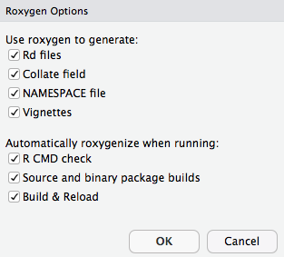

--- 
title: "Computing for Big Data (BST-262)"
author: "Christine Choirat"
date: "`r Sys.Date()`"
site: bookdown::bookdown_site
output: bookdown::gitbook
documentclass: book
bibliography: [book.bib, packages.bib]
biblio-style: apalike
link-citations: yes
github-repo: cchoirat/bigdata17
description: "Class notes for BST 262"
---


<!--chapter:end:index.Rmd-->

# Introduction {#intro}

## Logistics

- Fall 2 course
- Tuesday and Wednesday, 11:30am-1pm
- Contact info: cchoirat@iq.harvard.edu.  Please use BST232 in the email title.
- TA's: Qian Di (qiandi@mail.harvard.edu) and Ben Sabath (mbsabath@hsph.harvard.edu)
- Office hours: TBD
- Course GitHub repository https://github.com/cchoirat/bigdata17
- Open file in folder `_book/index.html`

## Prerequisites

For BST262 (Computing for Big Data), we assume familiarity with the material covered in BST260 (Introduction to Data Science).

We will use R to present concepts that are mostly language-agnostic.  We could have used Python, as in BST261 (Data Science II).

## Rationale

1. Available data grows at a much faster rate than available computing capacity.

2. Statistical software programs such as R were not designed to handle datasets of massive size.

## Big data bottlenecks

As described by @Lim2015, there are three bottlenecks:

- CPU
- RAM
- I/O

```{r echo=FALSE, fig.align="center", bottlenecks, fig.cap="Steps to execute an R program, from @Lim2015, Chapter 1."}
knitr::include_graphics("images/ch1_bottlenecks.png")
```
```{exercise}
Can you identify points 1--7 in the following code snippet?
```

```{r eval=FALSE}
data <- read.csv("mydata.csv")
totals <- colSums(data)
write.csv(totals, "totals.csv")
```

## Syllabus

Week 1 - Basic tools

- Lecture 1. Unix scripting, make
- Lecture 2. Version control: Git and GitHub (guest lecture: Ista Zhan)

Week 2 - Creating and maintaining R packages

- Lecture 3. Rationale, package structure, available tools
- Lecture 4. Basics of software engineering: unit testing, code coverage, continuous integration

Week 3 - Software optimization

- Lecture 5. Measuring performance: profiling and benchmarking tools
- Lecture 6. Improving performance: an introduction to C/C++, Rcpp

Week 4 – Databases

- Lecture 7. Overview of SQL (SQLite, PostgreSQL) and noSQL databases (HBase,
MongoDB, Cassandra, BigTable, ...)
- Lecture 8. R database interfaces (in particular through dplyr)

Week 5 - Analyzing data that does not fit in memory

- Lecture 9. Pure R solutions (sampling, `ff` and `bigmemory`, other interpreters). JVM solutions (h20, Spark)
- Lecture 10. An introduction to parallel computing; clusters and cloud computing.
“Divide and Conquer” (MapReduce approaches)

Week 6 – Visualization

- Lecture 11. Principles of visualization (guest lecture: James Honaker)
- Lecture 12. Maps and GIS: principles of GIS, using R as a GIS, PostGIS

Weeks 7 & 8 - Guest lectures (order and precise schedule TBD)

- Software project management (Danny Brooke)
- R and Spark (Ellen Kraffmiller and Robert Treacy)
- Advanced GIS and remote sensing (TBD)
- Cluster architecture (William J. Horka)

## Evaluation

Grades will be based on **two mandatory problem sets**. Each problem set will correspond to 50% (= 50 points) of the final grade. The first problem set will be available by the end of week 3 and the second problem set by the end of week 6.

You will be required to submit problem set solutions within two weeks. Grades, and feedback when appropriate, will be returned two weeks after submission.

You will submit a markdown document that combines commented code for data analysis and detailed and structured explanations of the algorithms and software tools that you used.

## Software tools and packages

We will mostly use [R](https://www.r-project.org/) in this course.  Some examples will be run in [Python](https://www.python.org/).

In general, we will use free and open-source software programs such as [PostgreSQL](https://www.postgresql.org/) / [PostGIS](http://postgis.net/) or [Spark](https://spark.apache.org/).

## Datasets

We have collected datasets to illustrate concepts.  They are hosted on a [Dropbox folder](https://www.dropbox.com/sh/mt4a7goxsl44swm/AADJK54wOXlDZjABMxN0DJIHa?dl=0).

### MovieLens

MovieLens by @Harper2015 [, https://grouplens.org/datasets/movielens/] collects datasets from the website https://movielens.org/.

There are datasets of different sizes.  We will use:

1. Small (1MB): https://grouplens.org/datasets/movielens/latest/
2. Benchmark (~190MB zipped): https://grouplens.org/datasets/movielens/20m/

### Airlines data

The airlines dataset comes from the U.S. Department of Transportation and were used in the [2009 Data Expo](http://stat-computing.org/dataexpo/2009/) of the American Statistical Association (ASA).

We will use a version curated by [h20o](https://www.h2o.ai/): https://github.com/h2oai/h2o-2/wiki/Hacking-Airline-DataSet-with-H2O. 

### Insurance claims

Claims data contain Protected Health Information (PHI).  There are strong privacy restrictions to store, use and share this type of data.

We will use [synthetic data](https://www.cms.gov/Research-Statistics-Data-and-Systems/Downloadable-Public-Use-Files/SynPUFs/DE_Syn_PUF.html) ([Sample 1](https://www.cms.gov/Research-Statistics-Data-and-Systems/Downloadable-Public-Use-Files/SynPUFs/DESample01.html)) from the Centers for Medicare and Medicaid Services (CMS).

### Census

Census data is commonly merged with administrative claims data such as Medicare.  We will use data from the [Census Bureau](https://www.census.gov/data.html).

### PM~2.5~ exposure

We will use PM~2.5~ exposure data from the [EPA Air Quality System (AQS)](https://www.epa.gov/aqs) to illustrate GIS linkage concepts.

### Methylation

If there is enough interest, we might present methylation examples.

## Contributing with GitHub

If you have suggestions, you can open a GitHub issue at https://github.com/cchoirat/bigdata17/issues.

If you want to contribute, we welcome [pull requests](https://help.github.com/articles/about-pull-requests/).

<!--chapter:end:01-intro.Rmd-->

# Basic tools {#basics}

In this Chapter, we present basic tools that will be important when interacting with big data systems, most importantly the command-line interface (CLI) in a Unix shell and several utilities (`less`, `awk`, `vi` and `make`).

## Command line tools

We assume some familiarity with the Unix shell, for example as in http://swcarpentry.github.io/shell-novice/.

We also assume that you have access to a shell, either because you use Linux or OS X or because you have the right tools on Windows (for example [Cygwin](https://www.cygwin.com/) or the Bash shell in Windows 10).

### Why use the command line?

- Batch processing

- Cluster and cloud computing

### Basic Unix commands

### Useful tools

#### `less`

#### `awk`

#### `vi`

### Example

Let's apply some of the techniques described in @Blackwell2012 on Fisher's Iris data set saved in tab-delimited format.  Of course, it is a small dataset easily processed with R:

```{r}
iris <- read.table("~/Dropbox/Data17/iris/iris.tab")
head(iris, n = 5)
```

In a shell, we can use:

```{r, engine='bash'}
head -n 6 ~/Dropbox/Data17/iris/iris.tab
```

Suppose that we only need to select two variables in our model, `Sepal.Length` and `Species`.  In R, we can use:

```{r, eval=FALSE}
iris_subset <- iris[, c("Sepal.Length", "Species")]
```

or

```{r}
iris_subset <- iris[, c(1, 5)]
head(iris_subset)
```

With the tidyverse, we can use *pipes*.  The `%>%` operator allows for performing chained operations.

```{r}
suppressMessages(library(dplyr))

iris %>%
  select(1, 5) %>% 
  head()
```

In a shell, the pipe operator to combine shell commands is `|` and we can use:

```{r, engine='bash'}
cut -f 1,5 ~/Dropbox/Data17/iris/iris.tab | head -n 7
```

To keep observations with "Sepal.Length" greater than 5:

```{r}
iris %>%
  filter(Sepal.Length > 5) %>% 
  head()
```

In the shell, we can use the `AWK` programming language.  We start from row `NR` 2 (we could start from row 1, it contains variable names) and select rows such that the second variable (`Sepal.Length`) is greater than 5.

```{r, engine='bash'}
awk 'NR == 2 || $2 > 5' ~/Dropbox/Data17/iris/iris.tab | head
```

```{exercise}
The iris dataset is also saved in .csv format at `~/Dropbox/Data17/iris/iris.csv`.  Use `AWK` and `tail` to select the last 5 observations where `Sepal.Width` is larger than 3.5 and `Petal.Length` is smaller than 1.5.
```

## Makefiles

`make` is a tool that helps put all the pieces of an analytic workflow together:

- data retrieving
- data cleaning
- analysis
- graphs
- reports
- ...

Dependency management

### Simulate data in R

```{r}
set.seed(123)
```

File `simulate_data.R`

```{r echo = TRUE, eval = TRUE}
# set.seed(123)
N <- 1000 # sample size

X1 <- rpois(n = N, lambda = 50)
X2 <- 10 + rbinom(n = N, prob = 0.8, size = 1)
Y <- 10 + 3 * X1 + -5 * X2 + 3 * rnorm(n = N)

write.csv(data.frame(Y = Y, X1 = X1, X2 = X2),
          "sample_data.csv", row.names = FALSE)
```

```{r}
head(data.frame(Y = Y, X1 = X1, X2 = X2))
```

### Create a plot in Python

File `create_graph.py`

```{python echo = TRUE, eval = FALSE}
import pandas as pd
import matplotlib.pyplot as plt

sim_data = pd.read_csv("sample_data.csv")

plt.figure()
sim_data.plot()
plt.savefig("plot.pdf", format = "pdf")
```

```{r echo=FALSE}
knitr::include_graphics("images/ch1_plot.jpg")
```

### Run statistical model in R

We can print the model output with:

```{r echo = TRUE, eval = TRUE}
sim_data <- read.csv("sample_data.csv")
summary(lm(Y ~ X1 + X2, data = sim_data))
```

### Run statistical model in R

To save the output, we use the `sink` function.

File `estimate_model.R`

```{r echo = TRUE, eval = FALSE}
sim_data <- read.csv("sample_data.csv")
summary(lm(Y ~ X1 + X2, data = sim_data))

sink("estimation_summary.txt")
summary(lm(Y ~ X1 + X2, data = sim_data))
sink()
```

### Makefile syntax

- `make` is a *command* that runs on a text file often named `Makefile`.

-  A `Makefile` contains one or several blocks with the following structure:

```{txt echo = TRUE}
targetfile: sourcefile(s)
[tab] command
```

### Naive version

File: `Makefile`

```{txt echo = TRUE}
sample_data.csv: simulate_data.R
	R CMD BATCH simulate_data.R

plot.pdf: create_graph.py
	python create_graph.py

estimation_summary.txt: estimate_model.R
	R CMD BATCH estimate_model.R
```

A simple call to `make` only builds the first target (`sample_data.csv`).  To build the other targets, we have to use: `make plot.pdf` and `make estimation_summary.txt`.

### Making all targets

File: `Makefile`

```{txt echo = TRUE}
all: analysis

analysis: sample_data.csv plot.pdf estimation_summary.txt

sample_data.csv: simulate_data.R
	R CMD BATCH simulate_data.R

plot.pdf: create_graph.py
	python create_graph.py

estimation_summary.txt: estimate_model.R
	R CMD BATCH estimate_model.R
```

New data is simulated and saved in `sample_data.csv`.  But `plot.pdf` and `estimation_summary.txt` are not updated.

### Dealing with dependencies

- Problem `plot.pdf` and `estimation_summary.txt` depend on `sample_data.csv`.
- Solution: explicit dependencies.

File: `Makefile`

```{txt echo = TRUE}
all: analysis

analysis: sample_data.csv plot.pdf estimation_summary.txt

sample_data.csv: simulate_data.R
	R CMD BATCH simulate_data.R

plot.pdf: sample_data.csv create_graph.py
	python create_graph.py

estimation_summary.txt: sample_data.csv estimate_model.R
	R CMD BATCH estimate_model.R
```

## Git and GitHub

Guest lecture by [Ista Zahn](https://www.iq.harvard.edu/people/ista-zahn).

<!--chapter:end:02-basics.Rmd-->

# Packages {#packages}

We strongly recommand @Wickham2015.

We assume the following packages are installed:

```{r, eval=FALSE}
install.packages(c("devtools", "roxygen2", "testthat", "knitr"))
```

## Why?

- Organize your code

- Distribute your code

- Keep versions of your code

## Package structure

- Folder hierarchy
    - `NAMESPACE`: package import / export
    - `DESCRIPTION`: metadata
    - `R/`: R code
    - `man/`: object documentation (with short examples)
    - `tests/`
    - `data/`
    - `src/`: compiled code
    - `vignettes/`: manual-like documentation
    - `inst/`: installed files
    - `demo/`: longer examples
    - `exec`, `po`, `tools`

## Building steps

- `R CMD build`

- `R CMD INSTALL`

- `R CMD check`

### `R CMD build`

```{r eval=FALSE}
R CMD build --help
```

_Build R packages from package sources in the directories specified by ‘pkgdirs’_

### `R CMD INSTALL`

```{r eval=FALSE}
R CMD INSTALL --help
```

_Install the add-on packages specified by pkgs.  The elements of pkgs can be relative or absolute paths to directories with the package sources, or to gzipped package 'tar' archives.  The library tree to install to can be specified via '--library'.  By default, packages are installed in the library tree rooted at the first directory in .libPaths() for an R session run in the current environment._

### `R CMD check`

```{r eval=FALSE}
R CMD check --help
```

http://r-pkgs.had.co.nz/check.html

_Check R packages from package sources, which can be directories or package 'tar' archives with extension '.tar.gz', '.tar.bz2', '.tar.xz' or '.tgz'._

_A variety of diagnostic checks on directory structure, index and control files are performed.  The package is installed into the log directory and production of the package PDF manual is tested. All examples and tests provided by the package are tested to see if they run successfully.  By default code in the vignettes is tested, as is re-building the vignette PDFs._

### Building steps with `devtools`

- `devtools::build`

- `devtools::install`

- `devtools::check`

- and many others: `load_all`, `document`, `test`, `run_examples`, ...

## Create an R package

### `utils::package.skeleton`

```{r eval=FALSE}
package.skeleton() # "in "clean" session ("anRpackage")
package.skeleton("pkgname") # in "clean" session

set.seed(02138)
f <- function(x, y) x+y
g <- function(x, y) x-y
d <- data.frame(a = 1, b = 2)
e <- rnorm(1000)
package.skeleton(list = c("f","g","d","e"), name = "pkgname")
```

### `devtools::create`

```{r eval=FALSE}
devtools::create("path/to/package/pkgname")
```

### Submit to CRAN

```{r echo=FALSE, fig.align="center", hydra, fig.cap="Submittin to CRAN.  It's not that bad..."}

```

Reading: http://r-pkgs.had.co.nz/release.html

## R packages on GitHub

Reading: http://r-pkgs.had.co.nz/git.html

- Version control

- Website, wiki

- Easy install: `install_github` from `devtools`

- Collaboration

- Issue tracking

#### RStudio and GitHub integration

```{r echo=FALSE, fig.align="center", pkg1, fig.cap="Create a new repository on GitHub"}
knitr::include_graphics("images/ch3_create_git_package_1.png")
```

```{r echo=FALSE, fig.align="center", pkg1, fig.cap="GitHub view"}
knitr::include_graphics("images/ch3_create_git_package_1_1.png")
```

```{r echo=FALSE, fig.align="center", pkg2, fig.cap="Create a new project in RStudio"}
knitr::include_graphics("images/ch3_create_git_package_2.png")
```

```{r echo=FALSE, fig.align="center", pkg3, fig.cap="Create an empty project"}
knitr::include_graphics("images/ch3_create_git_package_3.png")
```

```{r echo=FALSE, fig.align="center", pkg4, fig.cap="Create a new R package"}
knitr::include_graphics("images/ch3_create_git_package_4.png")
```

```{r echo=FALSE, fig.align="center", pkg4, fig.cap="Package template is created"}
knitr::include_graphics("images/ch3_create_git_package_4_1.png")
```

```{r echo=FALSE, fig.align="center", pkg5, fig.cap="Ready to run!  Notice the "Build" tab"}
knitr::include_graphics("images/ch3_create_git_package_5.png")
```

__Command line__

```{r eval=FALSE}
git init
git add *
git commit -m "First commit"
git remote add origin git@github.com:harvard-P01/pkgtemplate.git
git push -u origin master
```

```{r echo=FALSE, fig.align="center", pkg6, fig.cap=""}
knitr::include_graphics("images/ch3_create_git_package_6.png")
```

```{r echo=FALSE, fig.align="center", pkg7, fig.cap=""}
knitr::include_graphics("images/ch3_create_git_package_7.png")
```

### Installing from GitHub

```{r eval=FALSE}
devtools::install_github("harvard-P01/pkgtemplate")
```

```{r eval=FALSE}
devtools::install_github("harvard-P01/pkgtemplate",
                         build_vignettes = TRUE)
```

### `.gitignore`

RStudio default

```{r eval=FALSE}
.Rproj.user
.Rhistory
.RData
```

GitHub default

```{r eval=FALSE}
# History files
.Rhistory
.Rapp.history

# Example code in package build process
*-Ex.R

# RStudio files
.Rproj.user/

# produced vignettes
vignettes/*.html
vignettes/*.pdf
```

## RStudio projects

- `.Rproj` file extension, in our example `pkgtemplate.Rproj`

- A project has its own:
    - R session
    - .Rprofile (_e.g._, to customize startup environment)
    - .Rhistory

- Default working directory is project directory

- Keeps track of project-specific recent files

### Project options

```{r eval=FALSE}
Version: 1.0

RestoreWorkspace: Default
SaveWorkspace: Default
AlwaysSaveHistory: Default

EnableCodeIndexing: Yes
UseSpacesForTab: Yes
NumSpacesForTab: 2
Encoding: UTF-8

RnwWeave: knitr
LaTeX: pdfLaTeX

AutoAppendNewline: Yes
StripTrailingWhitespace: Yes

BuildType: Package
PackageUseDevtools: Yes
PackageInstallArgs: --no-multiarch --with-keep.source
```

### Package documentation

- Functions and methods

- Vignettes
    - PDF
    - `knitr` (or `Sweave`)

## Package workflow example

Creating R Packages: A Tutorial (Friedrich Leisch, 2009)

- https://cran.r-project.org/doc/contrib/Leisch-CreatingPackages.pdf

### Add `linreg.R` to `R/` directory

```{r eval=TRUE}
linmodEst <- function(x, y) {
  ## compute QR-decomposition of x
  qx <- qr(x)
  ## compute (x’x)^(-1) x’y
  coef <- solve.qr(qx, y)
  ## degrees of freedom and standard deviation of residuals
  df <- nrow(x) - ncol(x)
  sigma2 <- sum((y - x %*% coef) ^ 2) / df
  ## compute sigma^2 * (x’x)^-1
  vcov <- sigma2 * chol2inv(qx$qr)
  colnames(vcov) <- rownames(vcov) <- colnames(x)
  list(
    coefficients = coef,
    vcov = vcov,
    sigma = sqrt(sigma2),
    df = df
  )
}
```

### Run our function

```{r}
data(cats, package = "MASS")
linmodEst(cbind(1, cats$Bwt), cats$Hwt)
```

We can compare the output with `lm`.

```{r}
lm1 <- lm(Hwt ~ Bwt, data=cats)
lm1
coef(lm1)
```

```{r}
vcov(lm1)
summary(lm1)$sigma
```

### Add ROxygen2 documentation

```{r eval=FALSE}
#' Linear regression
#'
#' Runs an OLS regression not unlike \code{\link{lm}}
#'
#' @param y response vector (1 x n)
#' @param X covariate matrix (p x n) with no intercept
#'
#' @return A list with 4 elements: coefficients, vcov, sigma, df
#'
#' @examples
#' data(mtcars)
#' X <- as.matrix(mtcars[, c("cyl", "disp", "hp")])
#' y <- mtcars[, "mpg"]
#' linreg(y, X)
#'
#' @export
#'
linmodEst <- function(x, y) {
  ## compute QR-decomposition of x
  qx <- qr(x)
  ## compute (x’x)^(-1) x’y
  coef <- solve.qr(qx, y)
  ## degrees of freedom and standard deviation of residuals
  df <- nrow(x) - ncol(x)
  sigma2 <- sum((y - x %*% coef) ^ 2) / df
  ## compute sigma^2 * (x’x)^-1
  vcov <- sigma2 * chol2inv(qx$qr)
  colnames(vcov) <- rownames(vcov) <- colnames(x)
  list(
    coefficients = coef,
    vcov = vcov,
    sigma = sqrt(sigma2),
    df = df
  )
}
```

### Configure Build Tools

<div class="centered">

</div>

### `man/linmodEst.Rd`

```{r eval=FALSE}
% Generated by roxygen2 (4.1.1): do not edit by hand
% Please edit documentation in R/linmodEst.R
\name{linmodEst}
\alias{linmodEst}
\title{Linear regression}
\usage{
linmodEst(x, y)
}
\arguments{
\item{y}{response vector (1 x n)}

\item{X}{covariate matrix (p x n) with no intercept}
}
\value{
A list with 4 elements: coefficients, vcov, sigma, df
}
\description{
Runs an OLS regression not unlike \code{\link{lm}}
}
\examples{
data(mtcars)
X <- as.matrix(mtcars[, c("cyl", "disp", "hp")])
y <- mtcars[, "mpg"]
linmodEst(y, X)
}
```

### Formatted output

```{r echo=FALSE, fig.align="center", help, fig.cap=""}
knitr::include_graphics("images/ch3_formatted_help.png")
```

### `DESCRIPTION`

```{r eval=FALSE}
Package: pkgtemplate
Type: Package
Title: What the Package Does (Title Case)
Version: 0.1
Date: 2015-10-24
Author: Who wrote it
Maintainer: Who to complain to <yourfault@somewhere.net>
Description: More about what it does (maybe more than one line)
License: What license is it under?
LazyData: TRUE
```

### `NAMESPACE`

`export`'s automatically generated when parsing ROxygen2 snippets

```{r eval=FALSE}
export(linmodEst)
```

### S3 basics

Reading: http://adv-r.had.co.nz/S3.html

```{r}
hello <- function() {
 s <- "Hello World!"
 class(s) <- "hi"
 return(s)
}

hello()
```

```{r}
print.hi <- function(...) {
  print("Surprise!")
}

hello()
```

### S3 and S4 generics

Reading: http://adv-r.had.co.nz/S4.html

```{r}
linmod <- function(x, ...)
  UseMethod("linmod")
```

```{r}
linmod.default <- function(x, y, ...) {
  x <- as.matrix(x)
  y <- as.numeric(y)
  est <- linmodEst(x, y)
  est$fitted.values <- as.vector(x %*% est$coefficients)
  est$residuals <- y - est$fitted.values
  est$call <- match.call()
  class(est) <- "linmod"
  return(est)
}
```

### `print`

```{r}
print.linmod <- function(x, ...) {
  cat("Call:\n")
  print(x$call)
  cat("\nCoefficients:\n")
  print(x$coefficients)
}
```

```{r}
x <- cbind(Const = 1, Bwt = cats$Bwt)
y <- cats$Hw
mod1 <- linmod(x, y)
mod1
```

### Other methods

- `summary.linmod`

- `print.summary.linmod`

- `predict.linmod`

- `plot.linmod`

- `coef.linmod`, `vcov.linmod`, ...

### Formulas and model frames

```{r eval=FALSE}
linmod.formula <- function(formula, data = list(), ...) {
  mf <- model.frame(formula = formula, data = data)
  x <- model.matrix(attr(mf, "terms"), data = mf)
  y <- model.response(mf)
  est <- linmod.default(x, y, ...)
  est$call <- match.call()
  est$formula <- formula
  return(est)
}
```

## Unit testing

### Unit tests and `testthat`

http://r-pkgs.had.co.nz/tests.html

In package directory:

```{r eval=FALSE}
devtools::use_testthat()
```

pre-populates `test/testthat/`

Test files should start with `test` to be processed.

### `test_coef.R`

```{r eval=FALSE}
data(cats, package = "MASS")
l1 <- linmod(Hwt ~ Bwt * Sex, data = cats)
l2 <- lm(Hwt ~ Bwt * Sex, data = cats)

test_that("same estimated coefficients as lm function", {
  expect_equal(l1$coefficients, l2$coefficients)
})
```

```{r eval=FALSE}
==> devtools::test()

Loading pkgtemplate
Loading required package: testthat
Testing pkgtemplate
.
Woot! 
```

## Code coverage

## Continuous integration

## Vignettes

http://r-pkgs.had.co.nz/vignettes.html

```{r eval=FALSE}
devtools::use_vignette("linmod")
```

https://github.com/harvard-P01/pkgtemplate/blob/master/vignettes/linmod.Rmd

<!--chapter:end:03-packages.Rmd-->

# Optimization {#optimization}

In this Chapter, we will see how to measure and improve code performance.

## Measuring performance

### Profiling

### Benchmarking

## Improving performance

### Introduction to C/C++

### Rcpp

<!--chapter:end:04-optimization.Rmd-->

# Databases {#databases}

## Overview

## SQL

## noSQL

## R interfaces

<!--chapter:end:05-databases.Rmd-->

# Big data {#bigdata}

In this Chapter, we are going to review different approaches to handle and perform analyses on *data that does not fit in memory*.

## Reading big data (that fits in memory)

### R package comparison

### Python

## Sampling (can be read, not analyzed easily)

## Pure R solutions

## JVM solutions

### h20

### Spark

<!--chapter:end:06-bigdata.Rmd-->

# Visualization {#visualization}

## Principles of visualization

## Maps and GIS

<!--chapter:end:07-visualization.Rmd-->

`r if (knitr:::is_html_output()) '# References {-}'`

<!--chapter:end:08-references.Rmd-->

